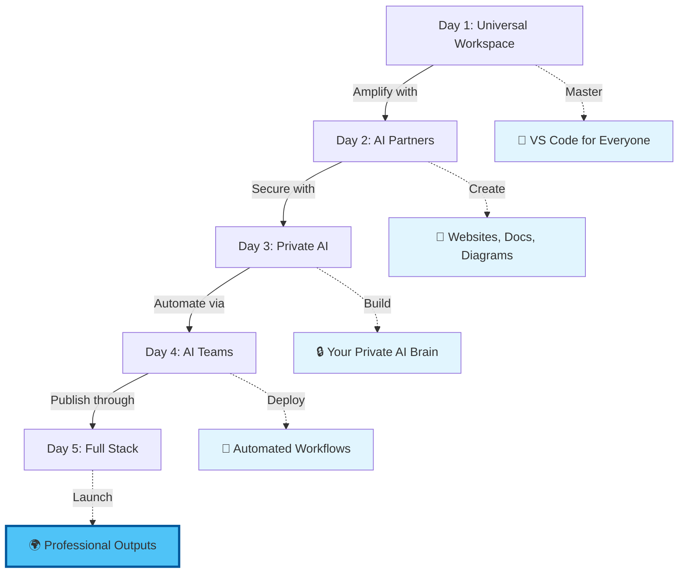

# AI-Powered Knowledge Work: Master the New Universal Workspace

## Executive Summary

In 2025, the boundary between "technical" and "non-technical" work has dissolved. Whether you're an academic writing complex grant proposals, a business owner creating strategic documents, a researcher managing knowledge bases, or a developer building systems—the same AI tools can transform your productivity 10x. But there's a catch: the no-code tools everyone uses barely scratch the surface of what's possible.

This intensive 5-day workshop reveals a powerful secret: VS Code isn't just for programmers anymore. It's become the universal control panel for AI, giving you direct access to the world's most powerful language models with the precision control that ChatGPT and Claude.ai can't match. Through "vibe coding"—a revolutionary approach where you describe what you want and AI creates it—you'll build websites, generate academic papers in LaTeX, create interactive project plans with Mermaid diagrams, and orchestrate AI agents to handle complex workflows.

**The choice is clear: remain limited by consumer AI tools, or gain professional-grade control over AI that transforms how you create, think, and work.**

---

## Who Is This For?

This workshop transcends traditional boundaries. You'll sit alongside:
- **Academics** creating sophisticated grant proposals and research papers
- **Business Leaders** building AI-powered documentation systems
- **Consultants** developing client deliverables 10x faster
- **Researchers** managing vast knowledge bases with RAG systems
- **Creative Professionals** generating interactive portfolios and presentations
- **Developers** who want to go beyond basic AI integration
- **Anyone** who works with documents, data, or complex information

## Your Transformation Journey

---

## 1. Programme Map at a Glance

| Day   | Theme                           | Morning (3 h)                                   | Afternoon (3 h)                                        | Your Achievement                               |
| ----- | ------------------------------- | ----------------------------------------------- | ------------------------------------------------------ | -------------------------------------------------- |
| **1** | *Universal AI Workspace*           | VS Code as your AI command center + containers for consistency                | Version control + Mermaid for project planning (Gantt charts, flowcharts)                  | Professional workspace with visual project documentation |
| **2** | *AI as Creative Partner* | Connect OpenAI, Gemini, Claude directly to your workspace | Master "vibe coding" - describe what you want, AI creates it           | Live website + automated content system |
| **3** | *Your Private AI Brain*            | Run AI models on YOUR computer - total privacy                   | Build a RAG system that remembers everything (PDFs, docs, notes)          | Personal AI that knows your entire knowledge base       |
| **4** | *AI Teams That Work For You*  | Deploy specialized agents: research, writing, analysis, coding       | Cost control + safety measures | AI team that handles complex multi-step tasks |
| **5** | *Professional Publishing*        | Automate quality checks and deployment | LaTeX academic papers, business reports, interactive websites          | Complete portfolio: papers, sites, documentation   |

---

## 2. Detailed Programme Overview: Transform How You Work with AI

This isn't another "prompt engineering" course. Over five transformative days, you'll gain powers that most people don't know exist: direct API access to AI models, granular control over outputs, the ability to process entire document libraries, and AI agents that work while you sleep. Each day builds on the last, taking you from AI consumer to AI conductor.

### Day 1 – Your Universal AI Workspace

**The Revelation:** VS Code isn't "coding software"—it's the most powerful document creation and automation platform ever built. Today you'll set up a workspace that gives you superpowers whether you're writing grants, creating business plans, or building systems.

**Morning – VS Code for Everyone (3 hours)**

* Transform VS Code into your personal AI command center
* Install game-changing extensions that work for ANY profession
* Set up "containers"—think of them as perfect, portable workspaces that never break
* Learn the interface through practical examples: writing a report, creating a presentation, planning a project

**Afternoon – Visual Thinking & Version Control (3 hours)**

* Master Mermaid diagrams: create Gantt charts for project management, flowcharts for processes, mind maps for brainstorming
* Version control isn't just for code—track changes in business documents, academic papers, creative projects
* Build your first "repository"—a smart folder that remembers every version of every document forever

**Your Day 1 Win:** A professional workspace with a visual project plan (Gantt chart) for your own real project, all version-controlled and backed up.

---

### Day 2 – AI as Your Creative Partner

**The Breakthrough:** Stop copying and pasting from ChatGPT. Connect AI directly to your workspace and watch it create entire websites, documents, and systems through natural conversation.

**Morning – Direct AI Access (3 hours)**

* Connect the world's best AI models (OpenAI, Google, Anthropic) directly to VS Code
* Compare their strengths: Claude for writing, GPT-4 for analysis, Gemini for research
* Real examples: Generate a business plan, create an academic abstract, design a website
* See your actual API costs (spoiler: it's 10x cheaper than subscriptions)

**Afternoon – "Vibe Coding" Magic (3 hours)**

* Master the art of "vibe coding"—describe what you want in plain language, AI builds it
* Create a complete website by chatting with AI (no coding knowledge required!)
* Build interactive presentations, data visualizations, and documents
* Deploy your creations live on the internet in minutes

**Your Day 2 Win:** A professional website created entirely through conversation with AI, live on the internet, that you can show clients/colleagues immediately.

---

### Day 3 – Your Private AI Brain (No Internet Required!)

**The Game-Changer:** What if AI could read your entire document library, remember everything, and answer questions using YOUR knowledge? What if it worked completely offline, keeping your sensitive data private?

**Morning – AI on YOUR Computer (3 hours)**

* Install AI models that run on your laptop—no internet, no subscriptions, total privacy
* Perfect for: confidential business documents, proprietary research, sensitive client data
* Compare local models: which ones excel at writing, analysis, coding, creativity
* Run multiple models simultaneously—like having a team of specialists

**Afternoon – Build Your Second Brain (3 hours)**

* Create a RAG (Retrieval-Augmented Generation) system—your personal AI librarian
* Feed it your documents: PDFs, Word files, spreadsheets, presentations, research papers
* Ask questions, get answers with exact citations from your own documents
* Use cases: "What did we decide in the March board meeting?", "Find all mentions of Project X across all proposals"

**Your Day 3 Win:** An AI system that knows everything you've ever written, works offline, and keeps your data 100% private.

---

### Day 4 – AI Teams That Work While You Sleep

**The Revolution:** Why do everything yourself? Deploy specialized AI agents that research, write, analyze, and create—autonomously. Like hiring a team of tireless experts.

**Morning – Meet Your AI Workforce (3 hours)**

* **Deep Research Agent**: Autonomously researches topics, fact-checks, and creates comprehensive reports
* **Document Creator**: Generates complete documents following your templates and style guides
* **Analysis Expert**: Processes data, creates visualizations, identifies patterns
* **Task Automator**: Handles repetitive workflows, updates documents, manages projects
* Real examples: Literature review for academics, market research for business, content creation for marketing

**Afternoon – Orchestrating Your AI Team (3 hours)**

* Make agents work together: Researcher → Writer → Editor → Publisher
* Safety first: Set spending limits, approval workflows, quality checks
* Cost management: Most tasks cost pennies, not pounds
* Real scenario: Agents collaborate to create a complete grant proposal or business report

**Your Day 4 Win:** A team of AI agents that can research a topic, write a report, create visuals, and format everything—while you focus on strategy.

---

### Day 5 – Professional Output & Automation

**The Culmination:** Transform your AI experiments into polished, professional deliverables that run on autopilot. Academic papers, business websites, client reports—all generated and maintained by AI.

**Morning – Quality Assurance & Automation (3 hours)**

* Set up automated quality checks: spelling, grammar, fact-checking, formatting
* Create workflows that run automatically: "Every Monday, generate the weekly report"
* Build safety nets: review processes, approval gates, version control
* Connect everything: Your RAG brain → AI agents → Quality checks → Publishing

**Afternoon – Professional Publishing Suite (3 hours)**

* **For Academics**: Generate LaTeX papers with proper citations, formatted for journals
* **For Business**: Create interactive reports with live data, charts, and executive summaries
* **For Consultants**: Build client microsites with integrated chatbots
* **For Everyone**: Mermaid diagrams for processes, GitHub Pages for web presence
* Launch your complete system: Knowledge base + AI agents + Professional outputs

**Your Day 5 Win:** A complete AI-powered workflow that produces professional documents, websites, and reports—all connected and automated.

---

## Why This Workshop, Why Now?

The gap between AI "users" and AI "masters" is widening rapidly. While most people copy-paste from ChatGPT, a small group has discovered how to wield AI with surgical precision. They're writing books in days, not months. Creating comprehensive business documentation in hours, not weeks. Building knowledge systems that make decisions autonomously.

**Three Critical Shifts in 2025:**

1. **The Professional AI Divide**: Consumer AI tools (ChatGPT, Claude.ai) are designed for casual users. Professional-grade control requires direct API access—exactly what VS Code provides. Those with this access operate at 10x the speed and quality.

2. **The Privacy Imperative**: Uploading sensitive documents to web services is increasingly risky. Local AI models eliminate this risk while providing comparable quality. Every organization needs someone who can deploy private AI.

3. **The Vibe Coding Revolution**: Traditional barriers between "technical" and "creative" work have crumbled. Describe what you want, and AI builds it. This workshop teaches you to conduct the orchestra, not play every instrument.

**Real Numbers from Our Alumni:**
- Academic grant writing: 70% time reduction
- Business documentation: 5x faster with higher consistency
- Research synthesis: Process 100 papers in the time it took to read 10
- Content creation: Generate, edit, and publish in one seamless flow

---

## Success Stories Across Industries

> **"I used to spend weeks on grant proposals. Now my AI agents do the research, I do the strategy, and we submit in days. Just won £2M in funding."**
> — Dr. Rachel Morrison, University Research Director

> **"The Mermaid + LaTeX workflow transformed our consultancy. Client reports that took days now take hours, with interactive diagrams and live data."**
> — James Liu, Management Consultant

> **"My RAG system contains 10 years of company knowledge. New employees get answers instantly. It's like having our entire history on tap."**
> — Sandra Patel, Operations Director

> **"I'm not technical, but vibe coding let me build our entire company handbook site. The AI understood what I wanted and built it beautifully."**
> — Michael Chang, HR Director

---
## Why Our Approach Works

* **Learn by Doing:** Every concept is immediately applied to YOUR real projects—not toy examples
* **Multiple Perspectives:** Work alongside people from different industries—academics learn from business leaders, developers from consultants
* **Incremental Mastery:** Each day builds on the last—by day 5, you're orchestrating complex systems
* **Safety First:** Learn cost control and privacy protection from day one—no surprise bills or data leaks
* **Lifetime Skills:** Not just tools, but principles that apply as AI evolves

The result is transformation: from someone who uses AI to someone who commands it.

---

## 3. Key Learning Outcomes

### Core Competencies You'll Master

**Universal Skills (For Everyone)**
- Transform VS Code into your personal AI command center
- Direct API access to multiple AI models—no more copy-paste limitations
- "Vibe coding"—describe what you want, AI creates it
- Version control for any document type—never lose work again
- Cost management—know exactly what AI operations cost (usually pennies)
- Privacy control—keep sensitive data on your machine

**Specialized Outputs by Profession**

**For Academics & Researchers:**
- LaTeX document generation with proper citations
- Literature review automation with source tracking
- Grant proposal templates with AI assistance
- Research data analysis and visualization
- Collaborative paper writing with version control

**For Business Leaders:**
- Interactive business plans with live charts
- HR documentation systems with chat interfaces
- Project management with Mermaid Gantt charts
- Company knowledge bases with RAG
- Automated report generation

**For Consultants & Agencies:**
- Client deliverables in multiple formats
- Rapid prototyping of solutions
- Knowledge management across projects
- Automated quality assurance
- Professional web presence with zero coding

**For Creative Professionals:**
- Portfolio websites through conversation
- Interactive presentations
- Content generation with brand consistency
- Multi-format publishing
- AI-assisted creative workflows

---

## 4. Why Choose This Programme

### Unique Value Proposition

**1. Vendor-Agnostic Architecture**
Learn to seamlessly switch between cloud providers and local deployments, avoiding vendor lock-in while optimizing for cost and performance.

**2. Protocol-First Design**
Early adoption of Model Context Protocol (MCP) ensures your skills remain relevant as the AI tooling landscape evolves.

**3. Real-World Benchmarks**
Test agents against industry-standard SWE-Bench challenges, not toy problems, ensuring practical applicability.

**4. Immediate Career Impact**
Leave with a complete portfolio demonstrating advanced AI integration skills, ready for technical interviews or client presentations.

**5. Balanced Learning Approach**
- Morning sessions: Hands-on technical implementation
- Afternoon sessions: Strategic thinking and system design
- Daily checkpoints: Concrete deliverables proving mastery

### Course Benefits

- **Small Cohort Size**: Maximum 10 participants ensures personalized attention
- **Expert Instructors**: Industry practitioners with production AI deployment experience
- **Lifetime Access**: Course materials, Discord community, and quarterly alumni workshops
- **Cloud Credits Included**: $200 in API credits across major providers
- **Hardware Flexibility**: Support for both local GPU and cloud-based development

---

## 5. Programme Information

### Who Should Attend?

**You're Perfect for This Workshop If You:**
- Work with documents, data, or complex information daily
- Feel limited by consumer AI tools like ChatGPT
- Need to maintain privacy while using AI
- Want to automate repetitive knowledge work
- Are curious about AI's potential beyond simple chat

**Specific Roles We've Transformed:**
- **Academics**: Professors, researchers, PhD students, grant writers
- **Business Professionals**: Executives, consultants, project managers, analysts
- **Government & NGO**: Policy writers, report creators, documentation specialists
- **Creative Industries**: Content creators, marketers, designers, writers
- **Technical Roles**: Developers, data scientists, IT managers, system architects
- **Entrepreneurs**: Founders, solopreneurs, small business owners

### Prerequisites

**Required:**
- Basic computer literacy (if you can use Word and Excel, you're ready)
- Curiosity and openness to new ways of working
- A real project to work on during the workshop

**NOT Required:**
- Programming experience (we'll teach what you need)
- Technical background (we start from first principles)
- Math or computer science knowledge
- **System Requirements**:
  - Docker Desktop 4.0+ (or WSL2 for Windows)
  - 16GB RAM minimum (32GB recommended for local models)
  - 50GB free disk space
  - Stable internet connection for cloud services
- **Mindset**: Curiosity and willingness to experiment

**Pre-Course Support**: We provide step-by-step setup videos and offer 1-on-1 tech check sessions. No one gets left behind.

### Schedule & Format
- **Duration**: 5 consecutive days
- **Hours**: 09:30 - 16:30 BST
- **Format**: Hybrid (Manchester studio or remote via Google Meet)
- **Structure**: 3-hour morning session + 3-hour afternoon session
- **Support**: Dedicated Slack channel for Q&A and collaboration

### What's Included
- Pre-configured Dev Container with all required tools
- Comprehensive course playbook (digital + printed)
- $200 cloud API credits
- Lifetime access to course repository and updates
- Certificate of completion
- Post-course mentorship session (30 minutes)

### Investment

**Standard Price**: £2,995

**Early Bird**: £2,495 (save £500) - Limited to first 5 registrations

**Context**: This investment equals less than 3 days of typical consulting rates, yet provides skills that will transform your entire approach to development. The included £200 in cloud credits alone covers initial project costs.

- **Team Discount**: 15% off for 3+ participants from same organization
- **Payment Plans**: 3-month interest-free option available
- **Satisfaction Guarantee**: Full refund if not satisfied after Day 1

### Next Cohorts

- **March 2025**: 17-21 March (Manchester + Remote) - **3 seats remaining**
- **May 2025**: 12-16 May (Manchester + Remote) - Early bird pricing available
- **July 2025**: 14-18 July (Manchester + Remote) - Just announced

*All sessions run 09:30-16:30 BST with breaks*

### How to Apply
1. Complete the online application form
2. Brief screening call (15 minutes)
3. Secure your spot with a deposit
4. Receive pre-course setup instructions
5. Join the cohort Discord channel

---

## Your Instructor

**Dr. John O'Hare** brings over 25 years of experience in emerging technologies, from pioneering VR systems in the 1990s to leading AI integration today. As Associate Director of R&D at DREAMLAB and an HP AI Lighthouse Partner, John combines deep technical expertise with practical industry experience.

- PhD in collaborative technologies
- Led 15+ person engineering teams
- Published researcher in immersive systems and AI
- Active practitioner in generative AI and agent systems

*"I've watched multiple technology waves transform our industry. The AI wave is different—it's faster, more profound, and more accessible. This workshop distills decades of experience into practical skills you can use immediately."*

---

## Frequently Asked Questions

**Q: What if I can't attend all 5 days?**
A: While we recommend full attendance, all sessions are recorded. You'll have lifetime access to materials and can join the next cohort's missed sessions.

**Q: Do I need a GPU for the local AI sections?**
A: No. We provide cloud alternatives for all local exercises. However, a GPU will enhance your experience with larger models.

**Q: I'm not technical. Will I be lost?**
A: Absolutely not. We've taught professors, HR managers, and consultants who'd never coded. VS Code is just a powerful text editor—if you can use Word, you can use VS Code. The AI does the complex work.

**Q: How is this different from online tutorials?**
A: Four key differences: (1) Structured progression designed for non-programmers too, (2) Work on YOUR actual projects with expert guidance, (3) Learn alongside diverse professionals, (4) Get "under the hood" access that tutorials can't teach.

**Q: What ongoing support is available?**
A: Lifetime access to our Discord community, quarterly alumni workshops, and a 30-minute 1-on-1 mentorship session within 3 months of completion.

**Q: Can my company customize this for our team?**
A: Yes. We offer private cohorts with customized content focusing on your specific use cases and tech stack.

---

## Ready to 10x Your Professional Output?

Join 200+ professionals from academia, business, government, and technology who've transformed how they work. This isn't about learning AI—it's about wielding it with precision to amplify your unique expertise.

**What Makes You Hesitate?**
- "I'm not technical" → Perfect. Most attendees aren't. AI does the technical work.
- "I don't have time" → You don't have time NOT to. Stay limited or leap ahead.
- "Seems expensive" → Compare 5 days of training to months of inefficiency.
- "My work is too specialized" → AI adapts to YOU, not vice versa.

**[Apply Now - March Cohort](#)** | **[Download Detailed Syllabus](#)** | **[Schedule a Call](#)**

*Limited to 10 participants per cohort. March cohort is 70% full.*

### Next Step: Secure Your Spot

1. **[Complete Application](#)** (5 minutes)
2. Brief screening call to ensure fit
3. Secure your spot with £500 deposit
4. Receive immediate access to pre-course materials
5. Join the cohort Discord channel

**Questions?** Email workshops@dreamlab.uk or call +44 20 XXXX XXXX

*Stop using AI like everyone else. Start commanding it like the few who know how.*
