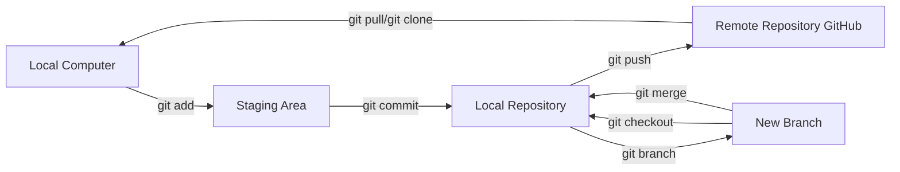

# Chapter 1: Why Git? Understanding Version Control

Before exploring the practicalities of Git, it is essential to understand its purpose. This chapter introduces [Git](https://git-scm.com/) and [GitHub](https://github.com/), explaining their roles and the specific problems they solve, particularly for creative technologists.

## 1.1 Problems Solved by Git

When working on complex projects—such as software development, interactive installations, detailed designs, or extensive documentation—you may encounter common challenges:

- Experimenting with new ideas without risking existing work.
- Accidentally deleting or overwriting important files and needing to revert changes.
- Collaborating with others and managing multiple versions of the same project.
- Sharing your work efficiently without relying on cumbersome file transfers.

Git is a **version control system** designed specifically to address these issues. It enables you to:

- **Experiment Safely:** Create separate "branches" to test new ideas without affecting your main project. Unsuccessful experiments can be discarded easily.
- **Track and Revert Changes:** Record incremental "commits" (snapshots) of your project, each with a clear description. This detailed history allows you to revert to any previous state quickly.
- **Collaborate Efficiently:** Manage contributions from multiple collaborators, simplifying the merging of changes and clearly attributing each modification.
- **Showcase Your Work:** Host your repositories online using platforms like GitHub, creating professional and accessible portfolios.
- **Engage with Open Source:** Participate in open-source projects, find collaborators, and build a visible presence within the creative technology community.

## 1.2 Core Git Concepts Explained

Below are the fundamental Git concepts explained clearly:

| Concept        | Explanation                                                |
| -------------- | ---------------------------------------------------------- |
| **Repository** | A directory that tracks every change made to its contents. Often abbreviated as "repo." |
| **Commit**     | A recorded snapshot of your project at a specific point in time, accompanied by a descriptive message. |
| **Branch**     | A parallel version of your project, allowing independent development of features or experiments. |
| **Remote**     | A cloud-hosted copy of your repository, typically on platforms like [GitHub](https://github.com/), used for sharing and backup. |

The following Mermaid diagram illustrates the typical Git workflow clearly:

## 1.3 Git vs. GitHub: Clarifying the Difference

A common source of confusion is the distinction between Git and GitHub:

- **Git:** The underlying version control software, originally developed by Linus Torvalds for managing Linux kernel development. Git operates locally on your computer and can function entirely offline.
- **GitHub:** A web-based platform that hosts Git repositories, providing additional features such as a graphical interface, collaboration tools (e.g., pull requests, issue tracking), user management, and services like [GitHub Pages](./05_github_pages.md).

In simple terms, Git is the core technology, while GitHub is one popular platform built upon Git. Although alternatives like GitLab and Bitbucket exist, GitHub remains the most widely used, particularly within the open-source community.

Throughout this tutorial, you will install and use Git locally, but your primary interaction with remote repositories will be through GitHub.

---

Next: [Chapter 2: Essential Setup: Accounts & Installations](./02_setup_overview.md)
