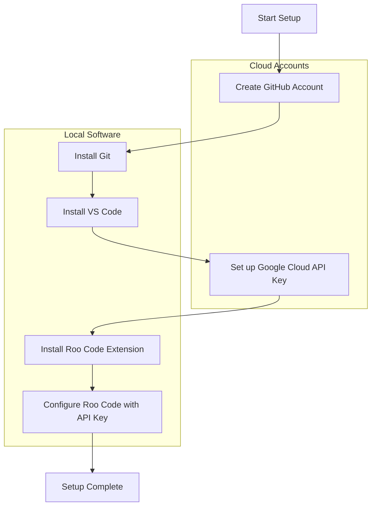

# Chapter 2: Essential Setup: Accounts & Installations

This chapter guides you through the essential setup required to establish your digital toolkit. Although the initial configuration involves several steps, it is primarily a one-time process. Completing this setup provides a robust, free, and powerful environment for your creative technology projects.

The setup process includes:

1. **[Creating Your GitHub Account](./02_a_github_account.md):**
   - Establish your presence on GitHub, the central platform for collaborative development and open-source contributions.

2. **[Installing Git & VS Code](./02_b_install_git_vscode.md):**
   - Install Git, the core version control system, and Visual Studio Code, your primary code editor.

3. **[Setting up a Google Cloud API Key](./02_c_gcp_api_key.md):**
   - Obtain a free API key from Google Cloud Platform to access powerful AI models like Google Gemini.

4. **[Configuring Roo Code in VS Code](./02_d_roo_code_config.md):**
   - Integrate AI capabilities directly into your VS Code environment using the Roo Code extension.

The following Mermaid diagram summarises the setup workflow clearly:

Take your time with each step. Once completed, you will have a fully functional development environment ready for productive work.

---

First up: [Chapter 2a: Creating Your GitHub Account](./02_a_github_account.md)