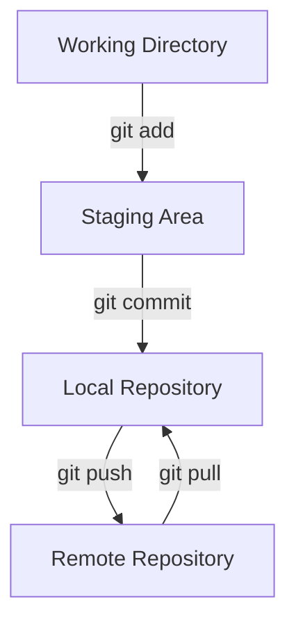

# Chapter 3: The Core Git Workflow

With your environment configured, this chapter introduces the fundamental Git workflow. You'll learn how to clone repositories, use essential Git commands, and perform basic version control tasks.

## 3.1 Cloning a Repository

Cloning creates a local copy of an existing repository, including all files and history.

### Steps to Clone:

1. **Find the Repository URL:**
   - On GitHub, navigate to the repository page.
   - Click the green "**<> Code**" button and copy the HTTPS URL provided.

2. **Clone Using VS Code (Recommended):**
   - Open VS Code and select "**Clone Git Repository...**" from the welcome screen.
   - Paste the repository URL and press Enter.
   - Choose a local folder to store the repository and click "Open" when prompted.

3. **Clone Using Command Line (Alternative):**
   - Open your terminal and navigate to your desired directory.
   - Run:
     ```bash
     git clone <repository_url>
     ```
   - Open the cloned folder in VS Code.

## 3.2 Essential Git Commands

Understanding basic Git commands is crucial. Here are the most common:

| Command                                      | Description                                     |
| -------------------------------------------- | ----------------------------------------------- |
| `git status`                                 | Shows current changes and untracked files.      |
| `git add <file>` or `git add .`              | Stages changes for commit.                      |
| `git commit -m "message"`                    | Commits staged changes with a descriptive message. |
| `git log`                                    | Displays commit history.                        |
| `git pull`                                   | Fetches and merges remote changes.              |
| `git push`                                   | Uploads local commits to the remote repository. |
| `git checkout -b <branch>`                   | Creates and switches to a new branch.           |
| `git branch`                                 | Lists, creates, or deletes branches.            |
| `git merge <branch>`                         | Merges specified branch into the current branch.|

### Git Workflow Diagram:



## 3.3 Guided Exercise: Your First Git Project

Practise the Git workflow locally:

1. **Create a Project Folder:**
   - In VS Code, select `File > Open Folder...` and create a new folder.

2. **Initialise Git Repository:**
   - Open the Source Control panel and click "**Initialize Repository**."

3. **Create and Modify a File:**
   - Create a file named `README.md` and add content:
     ```markdown
     # My Git Project
     This is my first Git-managed project.
     ```

4. **Stage and Commit Changes:**
   - Stage the file (`git add README.md`) and commit (`git commit -m "Initial commit"`).

5. **Create and Use a Branch:**
   - Create a new branch (`git checkout -b feature-branch`).
   - Modify `README.md`, stage, and commit changes.

6. **Switch Branches and Merge:**
   - Switch back to `main` (`git checkout main`) and merge your branch (`git merge feature-branch`).

7. **View History:**
   - Use the Git Graph extension (`Git Graph: View Git Graph`) to visualise your commit history.

This exercise demonstrates the core Git workflow: modify, stage, commit, branch, and merge.

---

Next: [Chapter 4: Collaboration & Recovery](./04_collaboration_recovery.md)