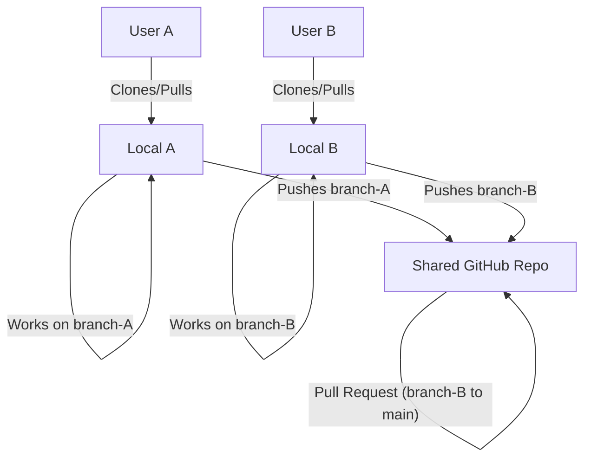
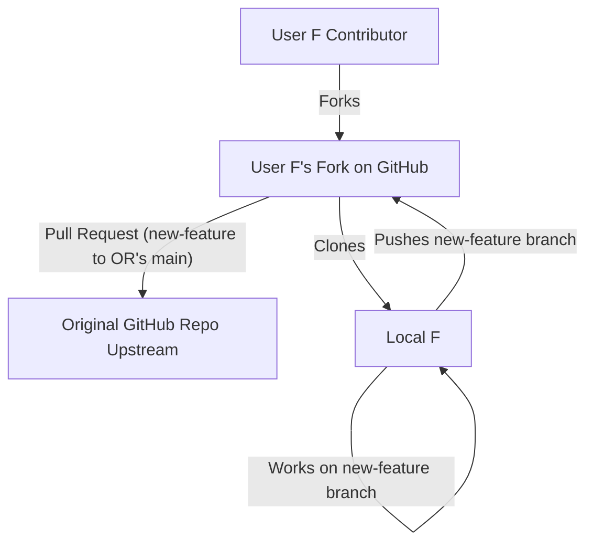

# Chapter 4: Collaboration & Recovery

[Git](https://git-scm.com/) truly shines when working in teams or when you need to safeguard your work against accidental mishaps. This chapter explores how to collaborate effectively using [GitHub](https://github.com/) and how to recover from common mistakes.

## 4.1 Forks vs. Branches: Choosing the Right Model

When collaborating, you'll primarily use either **forks** or **branches**. The choice depends on the context:

*   **Branches (for Private Team Work):**
    *   When you and your collaborators have direct write access to the same repository (e.g., you're all members of a GitHub organization or collaborators on a personal repository).
    *   Each team member typically works on features or fixes in separate branches within that shared repository.
    *   Changes are integrated back into the main branch (e.g., `main`) via [Pull Requests (PRs)](./04_collaboration_recovery.md#42-opening-a-pull-request-pr) within the same repository.
    *   This is the most common model for private projects or small, trusted teams.
    *   The workshop advice: "Use *branches* for private team work."

*   **Forks (for Public Open-Source Contributions or Restricted Access):**
    *   When you want to contribute to a project you *don't* have direct write access to (e.g., a public open-source project).
    *   A "fork" is your personal copy of someone else's repository on GitHub. It lives in your GitHub account.
    *   You make changes to your fork (typically on a branch within your fork).
    *   To propose your changes to the original project, you open a Pull Request from your forked repository to the original (upstream) repository.
    *   The workshop advice: "Use *forks* for public open‑source contributions."

**Visualising the Difference:**

**Branching Model (Shared Repository):**



**Forking Model (Contributing to External Repo):**



## 4.2 Opening a Pull Request (PR)

A **Pull Request (PR)** is a formal way to propose changes to a repository. It's a request to "pull" your changes (from your branch or fork) into another branch (often `main`). PRs are central to code review and collaboration on GitHub.

**Typical PR Workflow (after committing changes to your feature branch):**

1.  **Push Your Branch to GitHub:**
    If you've been working on a local branch (e.g., `experiment-neon`), you need to push it to the remote repository on GitHub.
    ```bash
    git push -u origin experiment-neon
    ```
    *   `-u origin experiment-neon` sets the upstream tracking reference for your local branch to the remote branch `experiment-neon` on `origin` (your remote repository). You usually only need `-u` the first time you push a new branch. Subsequent pushes can just be `git push`.

2.  **Create the Pull Request on GitHub:**
    *   After pushing, GitHub will often display a prompt on the repository's main page: "`experiment-neon` had recent pushes. Compare & pull request". Click this button.
    *   Alternatively, go to the "Pull requests" tab of the repository and click "New pull request."
    *   **Base and Compare:** Ensure the "base" branch is the one you want to merge into (e.g., `main`) and the "compare" branch is your feature branch (e.g., `experiment-neon`).
    *   **Title and Description:** Give your PR a clear title and a detailed description of the changes, why they were made, and any relevant context. This helps reviewers understand your contribution.
    *   **Create Pull Request:** Click the button to create the PR.

3.  **Review and Discussion:**
    *   Once the PR is open, team members can review the changes, leave comments, ask questions, and suggest modifications.
    *   If changes are requested, you can make further commits to your branch and push them. The PR will update automatically.

4.  **Merge the Pull Request:**
    *   After the PR is approved and any automated checks (like tests) pass, someone with merge permissions (or you, if it's your own project) can merge the PR. This incorporates your changes into the base branch.
    *   GitHub usually offers options like "Merge pull request," "Squash and merge," or "Rebase and merge."
    *   It's good practice to delete the feature branch after it's been merged (GitHub often provides a button for this).

**VS Code Integration:**
The workshop mentioned: "*Tip:* Use **GitHub Pull Requests & Issues** panel inside VS Code to create & review PRs without leaving your editor." VS Code has excellent extensions (like the official "GitHub Pull Requests and Issues" extension) that allow you to manage much of this workflow directly within the editor.

## 4.3 Undo Recipes: Recovering from Mistakes

Git is powerful, but it's also easy to make mistakes. Fortunately, Git provides many ways to undo changes. Here are a few common scenarios and their solutions, adapted from the `workshop.md`:

| Situation                                       | Command(s)                                                                 | Explanation                                                                                                                               |
| ----------------------------------------------- | -------------------------------------------------------------------------- | ----------------------------------------------------------------------------------------------------------------------------------------- |
| **Undo the last commit, but keep the changes**  | `git reset --soft HEAD~1`                                                  | Removes the last commit from history but leaves the changes from that commit in your working directory and staged. Useful if you committed too early or with a bad message. |
| **Discard unstaged edits to a specific file**   | `git checkout -- <file>`                                                   | Reverts the specified file to its state at the last commit. **Warning:** This permanently discards any uncommitted changes to that file. |
| **Discard all unstaged edits in all files**     | `git checkout .` or `git restore .`                                        | Reverts all tracked files in your working directory to their state at the last commit. **Warning:** Discards all uncommitted changes.     |
| **Unstage a file (move from staged to unstaged)** | `git reset HEAD <file>` or `git restore --staged <file>`                 | Removes the file from the staging area, but keeps the changes in your working directory. Useful if you `git add`ed a file by mistake. |
| **Amend the last commit message**               | `git commit --amend -m "New commit message"`                               | Replaces the previous commit message with a new one. You can also add more staged changes to the amended commit. **Avoid amending commits already pushed to a shared remote.** |
| **Revert a pushed commit by creating a new one**| `git revert <commit_sha>`                                                  | Creates a *new* commit that undoes the changes introduced by the specified `<commit_sha>`. This is safer for shared history than `git reset` because it doesn't rewrite past history. |
| **Recover a deleted branch (if you know its last commit SHA)** | `git reflog` (to find the SHA)<br>`git branch <new_branch_name> <sha>` | `git reflog` shows a history of where `HEAD` has pointed. Find the SHA of the commit that was the tip of your deleted branch, then recreate the branch pointing to that SHA. |

**Important Considerations for "Undo" Operations:**

*   **`git reset` vs. `git revert`:**
    *   `git reset` (especially with `--hard`) rewrites history. It's generally safe for local commits that haven't been pushed. **Avoid using `git reset` on commits that have already been pushed to a shared remote repository**, as it can cause major problems for collaborators.
    *   `git revert` creates a *new* commit that undoes previous changes. It's the safer way to undo changes that are already part of the shared project history.
*   **VS Code Source Control Panel:** Many of these "undo" operations can also be performed through the VS Code Source Control panel's UI (e.g., "Discard Changes," "Unstage Changes").

Understanding these recovery methods will give you more confidence to experiment, knowing that Git provides robust ways to backtrack if needed.

---

Next: [Chapter 5: GitHub Pages: Your Free Portfolio Site](./05_github_pages.md)
