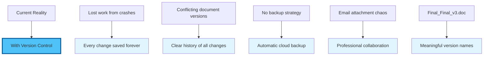
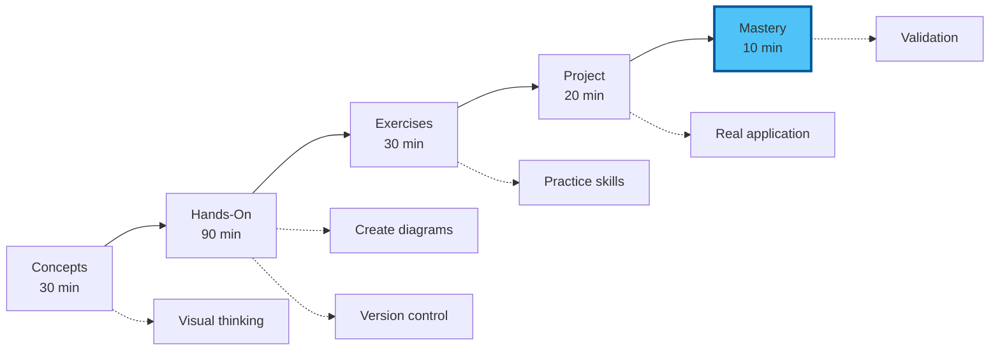

# Chapter 0: Introduction to Visual Tools & Version Control

## From Chaos to Clarity: Your Professional Documentation System

Welcome back! This afternoon, you'll discover how to create stunning visual documentation and implement a version control system that ensures you never lose work again. By combining Mermaid diagrams with Git, you'll build a professional documentation workflow that rivals any enterprise system.

## The Power of Visual Communication

In today's information-rich world, the ability to communicate complex ideas visually is a superpower. Whether you're:

- **Planning projects** with Gantt charts
- **Documenting processes** with flowcharts
- **Explaining systems** with architecture diagrams
- **Tracking decisions** with mind maps
- **Showing relationships** with entity diagrams

Visual tools transform walls of text into instantly understandable insights.

## Why Version Control Matters (Even for Non-Developers)

Imagine if you could:

## What You'll Master This Afternoon

### Visual Documentation Skills

1. **Mermaid Mastery**
   - Create any diagram type from text
   - Build interactive visualizations
   - Export professional graphics
   - Integrate with your documents

2. **Project Visualization**
   - Gantt charts for timeline planning
   - Flowcharts for process documentation
   - Mind maps for brainstorming
   - Sequence diagrams for workflows

### Version Control Superpowers

1. **Git Fundamentals**
   - Save work with meaningful checkpoints
   - Track who changed what and when
   - Recover any previous version
   - Branch for experiments

2. **GitHub Integration**
   - Free cloud backup
   - Professional portfolio
   - Collaboration tools
   - Automatic website hosting

## Real-World Transformations

### Before This Module
- Draw diagrams in PowerPoint (tedious)
- Save multiple file versions manually
- Email documents back and forth
- Lose work from crashes
- No clear change history

### After This Module
- Generate diagrams from descriptions
- Automatic version tracking
- Professional collaboration platform
- Work backed up to cloud
- Complete audit trail

## Success Stories from the Field

> "I used to spend hours in Visio. Now I describe what I want and get beautiful diagrams instantly. Game changer for my consulting work."
> — David Park, Strategy Consultant

> "Version control seemed like a developer thing. Now I can't imagine managing my research papers without it. It's like Track Changes on steroids."
> — Dr. Emma Thompson, Research Fellow

> "My project Gantt charts update automatically as I type. What took hours in MS Project now takes minutes."
> — Sarah Mitchell, Project Manager

## Module Learning Path

## Your Instructor's Promise

By the end of this session, you will:

1. **Create professional diagrams** faster than ever before
2. **Never lose work** with automatic version control
3. **Build a portfolio** showcasing your projects
4. **Collaborate professionally** without email attachments
5. **Feel confident** with tools used by millions of professionals

## The Paradigm Shift

### Traditional Approach
- Diagrams = Specialised software + manual drawing
- Versions = Save As... Final_Final_FINAL.doc
- Backup = Remember to copy to USB
- Sharing = Email attachments

### Your New Approach
- Diagrams = Describe in text → Instant visuals
- Versions = Automatic tracking of every change
- Backup = Continuous cloud synchronisation
- Sharing = Professional collaboration platform

## What Makes This Different

This isn't about becoming a "technical person." It's about:

- **Efficiency**: 10x faster diagram creation
- **Professionalism**: Enterprise-grade tools
- **Security**: Never lose work again
- **Clarity**: Communicate complex ideas simply
- **Portfolio**: Showcase your expertise

## Prerequisites Check

Before we begin, ensure you have:
- [x] Completed Module 05 (VS Code setup)
- [x] VS Code running with AI configured
- [x] Internet connection for GitHub
- [x] A project in mind to visualise
- [x] Enthusiasm for visual communication

## Time Investment & Returns

### This Afternoon: 3 Hours
- 30 minutes: Understanding concepts
- 90 minutes: Hands-on implementation
- 30 minutes: Practice exercises
- 20 minutes: Real project application
- 10 minutes: Assessment & celebration

### Your Return: Lifetime Value
- Save 5+ hours per week on documentation
- Never lose work to crashes again
- Create professional visuals in minutes
- Build an impressive portfolio
- Join the professional documentation elite

## Let's Transform Your Documentation

This afternoon's session will revolutionize how you create, manage, and share professional documentation. You'll leave with:

- A complete visual documentation system
- Version control for all your work
- Professional diagrams in your projects
- Confidence with enterprise tools
- A foundation for collaboration

Ready to make your work visually stunning and professionally managed?

---

Next: [Chapter 1: Core Concepts - Visual Thinking & Version Control](./01_concepts.md)

[Back to Module Overview](README.md) | [Skip to Hands-On](./02_hands_on.md)
