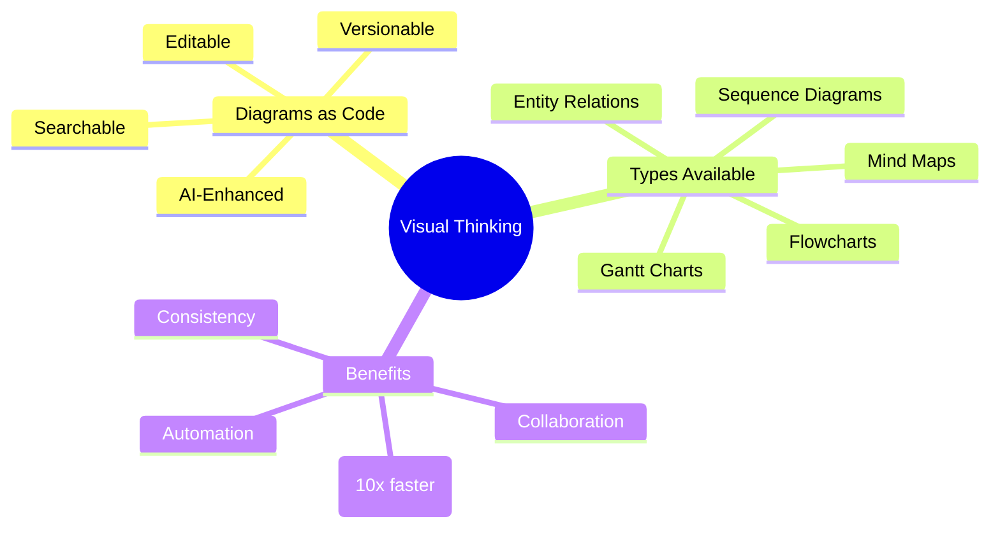
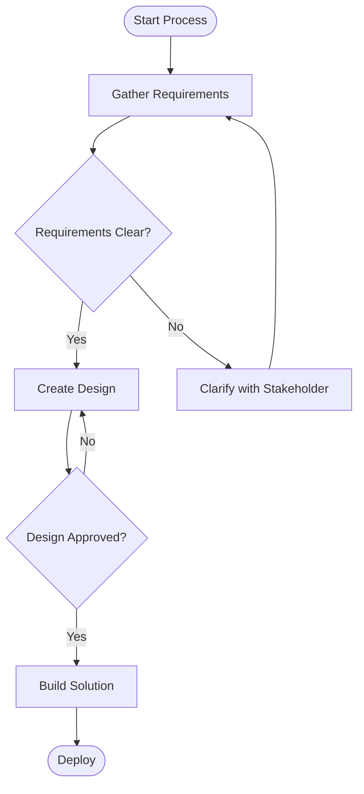
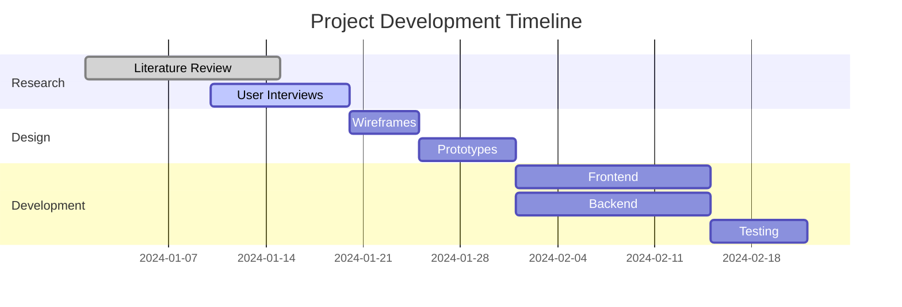
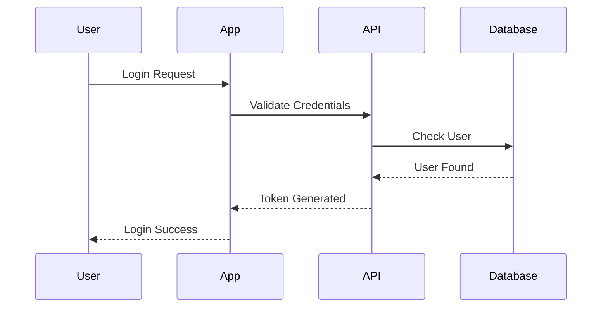
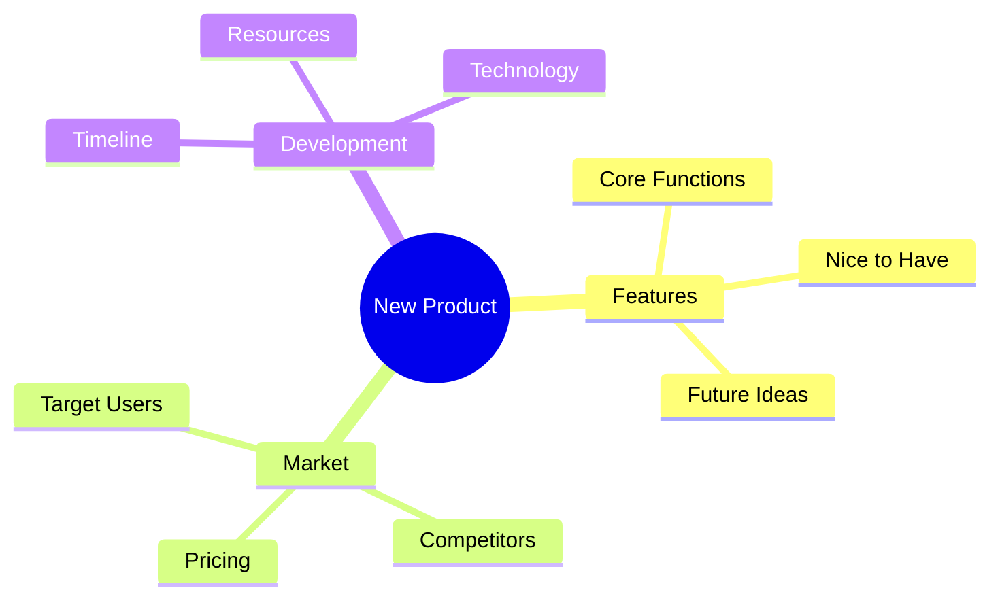
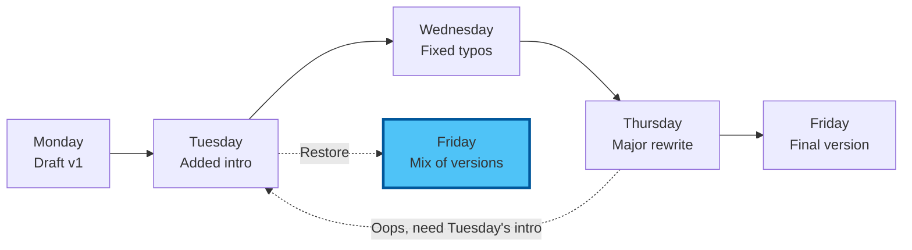
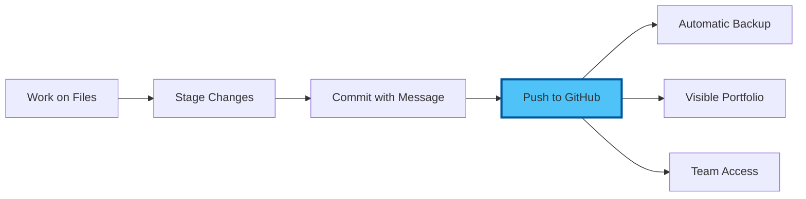
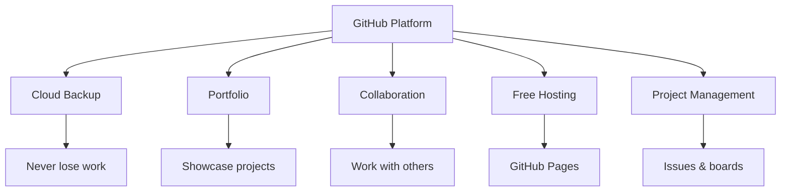
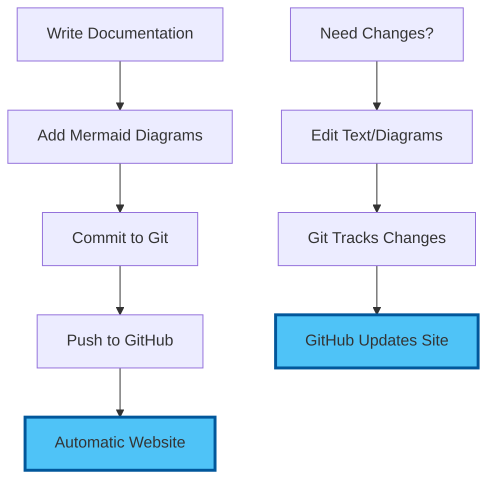
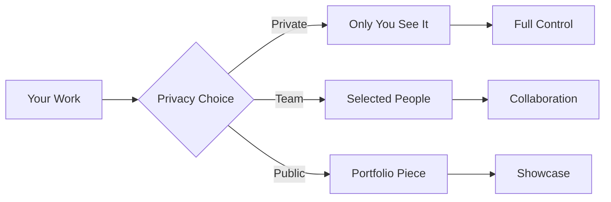

# Chapter 1: Core Concepts - Visual Thinking & Version Control

## The Foundation of Professional Documentation

Before we dive into creating stunning diagrams and tracking every change, let's understand the powerful concepts that will transform your documentation workflow forever.

## 1.1 Visual Thinking: From Text to Graphics

### The Mermaid Revolution

Mermaid is a game-changing tool that converts text descriptions into professional diagrams. Think of it as:

```mermaid
graph TD
    A[Your Ideas in Text] -->|Mermaid Magic| B[Professional Diagrams]
    
    C[Write: "User logs in"] -->|Becomes| D[Flow Chart]
    E[Type: "Project timeline"] -->|Transforms to| F[Gantt Chart]
    G[Describe: "System parts"] -->|Renders as| H[Architecture Diagram]
    
    style B fill:#4fc3f7,stroke:#01579b,stroke-width:3px
```

### Why Text-Based Diagrams Win

**Traditional Diagramming:**
- Open specialised software
- Manually draw shapes
- Align and connect elements
- Export as image
- Update? Start over!

**Mermaid Approach:**
- Type what you want
- Instant professional diagram
- Change text = Update diagram
- Version control friendly
- AI can generate for you

### The Mental Model Shift



## 1.2 Mermaid Diagram Types

### 1. Flowcharts - Process Documentation

Perfect for showing decision flows, processes, and algorithms:



### 2. Gantt Charts - Project Planning

Transform project timelines into visual roadmaps:



### 3. Sequence Diagrams - Interaction Flows

Show how different parts of a system communicate:



### 4. Mind Maps - Brainstorming

Organise thoughts and ideas visually:



## 1.3 Version Control: Your Time Machine

### What Is Git?

Git is a system that tracks changes to your files over time. Imagine:



### Core Concepts Simplified

**Repository (Repo)**
- Your project's home
- Contains all files and history
- Like a smart folder that remembers everything

**Commit**
- A snapshot in time
- Like pressing "Save" with a note
- Can always return to any commit

**Branch**
- Parallel version of your work
- Experiment without breaking things
- Merge back when ready

**Remote**
- Cloud backup (GitHub)
- Collaboration hub
- Portfolio showcase

### The Version Control Workflow



## 1.4 GitHub: Your Professional Platform

### More Than Storage

GitHub transforms Git into a complete professional platform:



### Key Benefits for Non-Developers

1. **Professional Profile**
   - Public portfolio of your work
   - Contribution history
   - Professional credibility

2. **Collaboration Without Email**
   - Comments on specific lines
   - Suggest changes
   - Track discussions

3. **Free Website Hosting**
   - GitHub Pages
   - Automatic from your repo
   - Professional URLs

4. **Project Management**
   - Issue tracking
   - Project boards
   - Milestone planning

## 1.5 Integration Magic

### Mermaid + Git + GitHub = Superpowers

When combined, these tools create a documentation system that:



### Real-World Workflow

1. **Morning**: Create project plan with Gantt chart
2. **Afternoon**: Update progress, diagram auto-updates
3. **Evening**: Commit changes with clear message
4. **Night**: Work backed up to GitHub
5. **Next Day**: Continue with full history

## 1.6 Security & Privacy Considerations

### Your Control Panel



### Best Practices

1. **Sensitive Information**
   - Never commit passwords
   - Use private repos for confidential work
   - Review before pushing

2. **Intellectual Property**
   - Understand your organisation's policies
   - Use private repos for proprietary work
   - Add appropriate licenses

3. **Personal vs Professional**
   - Separate accounts if needed
   - Clear commit messages
   - Professional presence

## 1.7 The Learning Path Ahead

### Today's Journey

```mermaid
graph LR
    A[Concepts<br/>(You are here)] --> B[Setup Tools]
    B --> C[Create Diagrams]
    C --> D[Version Control]
    D --> E[GitHub Portfolio]
    E --> F[Real Project]
    
    style A fill:#4fc3f7,stroke:#01579b,stroke-width:3px
```

### Skills You'll Master

1. **Immediate**: Create any diagram in minutes
2. **Today**: Full version control workflow
3. **This Week**: Collaborative documentation
4. **This Month**: Complete documentation system
5. **Ongoing**: Portfolio that grows with you

## Key Takeaways

✅ **Mermaid** converts text to professional diagrams instantly  
✅ **Git** creates a time machine for your work  
✅ **GitHub** provides professional hosting and collaboration  
✅ **Integration** multiplies the power of each tool  
✅ **Visual thinking** communicates complex ideas simply  

## Mental Preparation

Before the hands-on section:

1. **Forget** everything about "this is for developers"
2. **Embrace** the power of text-based diagrams
3. **Trust** that version control will save you time
4. **Imagine** never losing work again
5. **Prepare** to impress colleagues

---

Next: [Chapter 2: Hands-On Implementation](./02_hands_on.md)

[Back to Introduction](./00_introduction.md) | [Back to Module Overview](README.md)
