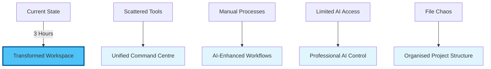

# Chapter 0: Introduction to VS Code as Your AI Command Centre

## Welcome to Your Universal Workspace Revolution

Welcome to the first transformative step in your journey from AI consumer to AI commander. Today, you'll discover that VS Code isn't "coding software"—it's the most powerful document creation and automation platform ever built, and it's about to become your personal AI command centre.

## The Paradigm Shift: Beyond "Technical" vs "Non-Technical"

In 2025, the boundary between "technical" and "non-technical" work has dissolved. Whether you're:

- An **academic** writing complex grant proposals
- A **business owner** creating strategic documents
- A **researcher** managing knowledge bases
- A **consultant** developing client deliverables
- A **creative professional** building portfolios

The same AI tools that developers use can transform your productivity 10x. But there's a crucial insight: the consumer AI tools everyone uses (ChatGPT, Claude.ai) barely scratch the surface of what's possible.

## Why VS Code? The Universal Control Panel

VS Code has evolved from a developer's tool to become the universal interface for AI interaction. Here's why it matters:

### 1. Direct AI Access
Unlike web interfaces, VS Code gives you:
- Direct API connections to multiple AI models
- Granular control over outputs
- The ability to process entire document libraries
- Context-aware AI that understands your project structure

### 2. Unified Workspace
Everything in one place:
- Documents, code, and data
- Version control and collaboration
- AI assistants and automation
- Publishing and deployment tools

### 3. Professional-Grade Control
Features unavailable in consumer tools:
- Cost tracking and optimization
- Privacy controls for sensitive data
- Batch processing capabilities
- Custom workflows and automation

## Your Journey Today

By the end of this morning session, you'll have:

## What Makes This Different

### Traditional Approach
- Copy-paste from ChatGPT
- Manually manage files
- Pay for multiple AI subscriptions
- Hope for consistent results

### Your New Approach
- AI works directly in your documents
- Automatic organisation and versioning
- Pay only for what you use (10x cheaper)
- Reproducible, professional results

## Real-World Transformations

> "I thought VS Code was for programmers. Now I use it to write grant proposals with AI assistance. Last month's £2M funding win took days, not weeks."
> — Dr. Sarah Chen, Research Director

> "My entire consultancy runs through VS Code now. Client reports that took days now take hours, with better quality and consistency."
> — Michael Roberts, Management Consultant

## Module Structure

This morning's journey is carefully designed for maximum impact:

1. **Concepts (30 min)**: Understanding the VS Code ecosystem
2. **Hands-On Setup (90 min)**: Building your command centre
3. **Practical Exercises (30 min)**: Immediate productivity gains
4. **Real Project (20 min)**: Apply to your actual work
5. **Assessment (10 min)**: Validate your new skills

## Prerequisites Check

Before we begin, ensure you have:
- [ ] A computer with admin access
- [ ] Internet connection
- [ ] An open mind about what's possible
- [ ] A real project in mind to work on

No coding experience required. If you can use Microsoft Word, you can master VS Code.

## Important Notes

### On Pace and Practice
- This material is dense but transformative
- Take breaks when needed
- Focus on understanding, not memorising
- Everything will "click" during hands-on practice

### On AI Integration
- We'll start with free tools and options
- You'll learn to evaluate costs vs benefits
- Privacy and security are built in from the start
- You control how AI accesses your work

## Your Instructors' Promise

By the end of this session, you will:
1. Have a fully configured AI command centre
2. Understand why developers guard these tools so closely
3. Complete at least one real task faster than ever before
4. Never want to go back to your old workflow

## Ready to Transform?

Let's begin this journey. In the next section, we'll explore the core concepts that make VS Code the ultimate AI interface. Remember: this isn't about becoming a programmer—it's about gaining superpowers for whatever work you do.

---

Next: [Chapter 1: Core Concepts - Understanding Your New Universe](./01_concepts.md)

[Back to Module Overview](README.md) | [Skip to Hands-On](./02_hands_on.md)
