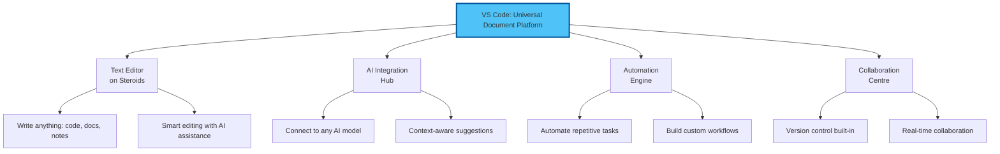
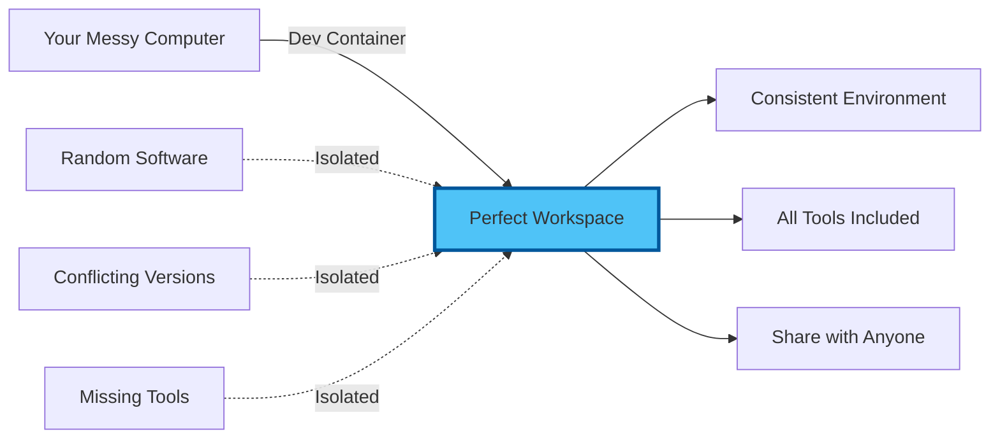
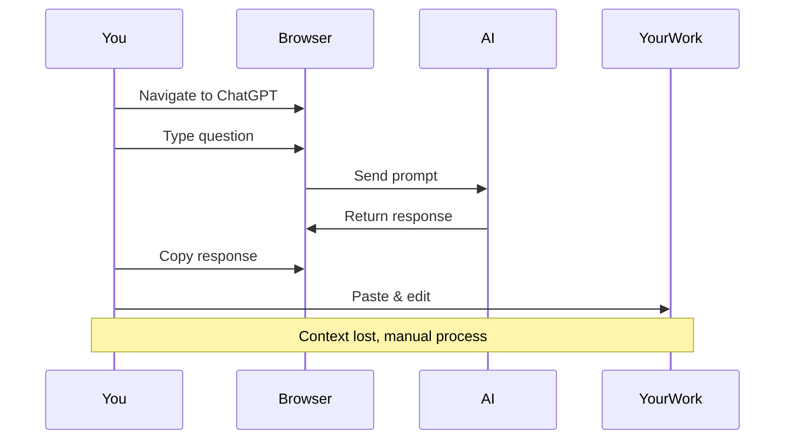
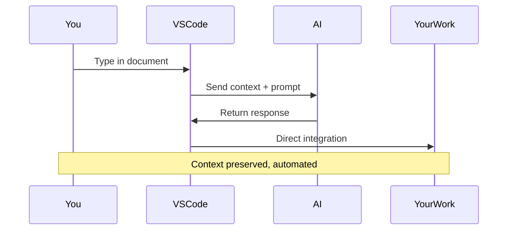
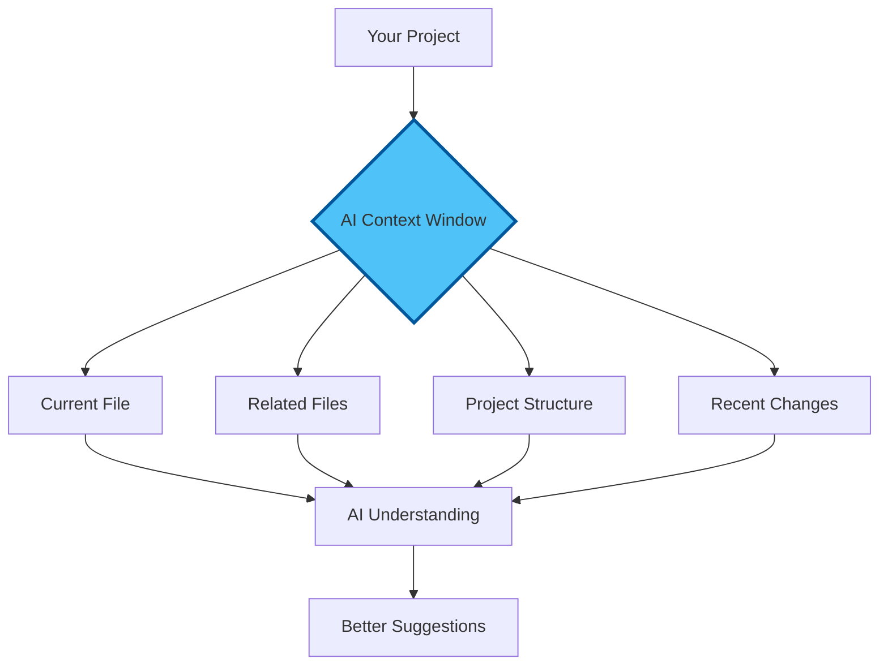
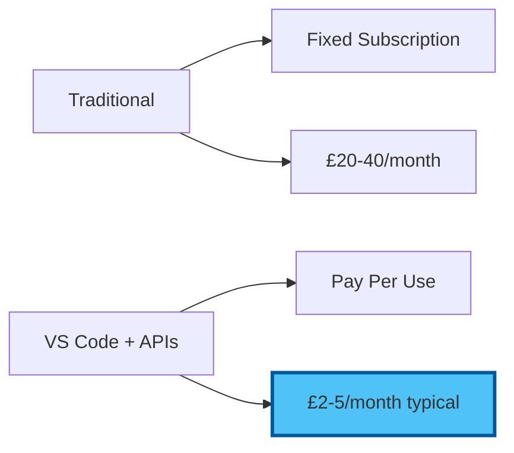
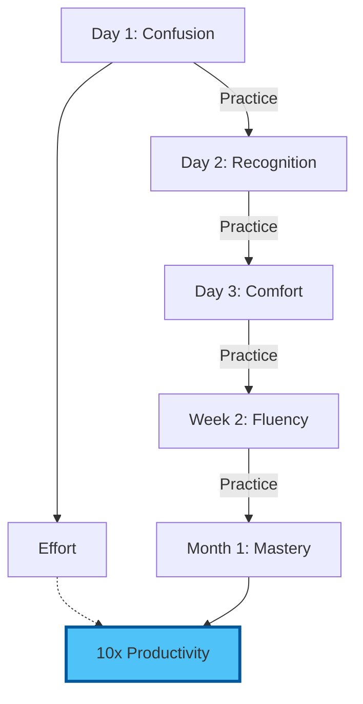

# Chapter 1: Core Concepts - Understanding Your New Universe

## The Mental Model Shift

Before diving into buttons and menus, let's establish the conceptual framework that will transform how you think about document creation and AI interaction.

## 1.1 VS Code: More Than Meets the Eye

### What VS Code Really Is

Think of VS Code not as "coding software" but as:



### The Power of Extensions

VS Code's true power lies in its extensibility. Think of extensions as apps for your phone:

- **Base VS Code**: Like a smartphone out of the box
- **Extensions**: The apps that make it yours
- **AI Extensions**: Your gateway to language models
- **Productivity Extensions**: Tools for every profession

## 1.2 The Container Revolution

### What Are Dev Containers?

Imagine having a perfect workspace that:
- Never breaks
- Works identically on any computer
- Includes all tools pre-configured
- Can be shared with anyone

That's a Dev Container—your workspace in a box.



### Why Containers Matter for Non-Developers

1. **Zero Configuration**: Tools just work
2. **No Conflicts**: Your workspace won't affect other software
3. **Portability**: Same environment on any computer
4. **Recovery**: Broke something? Rebuild in seconds

## 1.3 The AI Integration Paradigm

### Traditional AI Usage



### VS Code AI Integration



## 1.4 Key Concepts to Master

### 1. Workspace
Your project folder containing:
- All your documents
- Configuration files
- AI conversation history
- Version control data

### 2. Extensions
Add-on tools that extend VS Code:
- **AI Assistants**: Copilot, Continue, Codeium
- **Language Support**: Markdown, LaTeX, more
- **Productivity**: Spell check, diagrams, previews

### 3. Command Palette
Your universal control centre:
- Press `Ctrl+Shift+P` (or `Cmd+Shift+P` on Mac)
- Type what you want to do
- VS Code finds the command

### 4. Integrated Terminal
Your command line interface:
- Run commands without leaving VS Code
- Install tools and packages
- Automate workflows

### 5. Source Control
Built-in Git integration:
- Track every change
- Collaborate with others
- Never lose work again

## 1.5 The File System Philosophy

### Everything Is a File

In VS Code's world:
- **Documents**: Markdown, text, Word docs
- **Data**: JSON, CSV, XML
- **Configuration**: Settings and preferences
- **Code**: Scripts and automation

All treated equally, all enhanced by AI.

### Project Structure

A well-organised project might look like:

```
my-project/
├── README.md           # Project overview
├── .vscode/            # VS Code settings
├── documents/          # Your writing
├── research/           # Reference materials
├── templates/          # Reusable formats
└── outputs/            # Generated content
```

## 1.6 The AI Context Window

### Understanding Context

AI models have a "context window"—how much they can "see" at once:



### Managing Context Effectively

1. **Keep related files together**
2. **Use descriptive file names**
3. **Add comments and documentation**
4. **Let AI see your project structure**

## 1.7 Security and Privacy First

### Your Data, Your Control

Unlike web-based AI tools:
- Files stay on your computer
- You choose what AI can access
- API keys are yours to manage
- Local models = complete privacy

### Cost Transparency



## 1.8 The Mindset Shift

### From Consumer to Commander

**Consumer Mindset**:
- "What can this AI do for me?"
- Accept limitations
- Work around constraints

**Commander Mindset**:
- "How can I make AI do exactly what I need?"
- Extend capabilities
- Build custom solutions

### The Learning Curve Reality



## Key Takeaways

1. **VS Code is a universal document platform**, not just for coders
2. **Extensions make it infinitely customizable** for your needs
3. **Containers ensure consistency** without technical complexity
4. **AI integration is deeper** than any web interface
5. **You maintain control** over data, costs, and privacy
6. **The learning investment pays off** exponentially

## Reflection Questions

Before moving to hands-on setup:

1. What repetitive tasks in your work could benefit from AI automation?
2. How much time do you currently spend copying between AI tools and documents?
3. What would you do with 10x more productive hours?

## Ready for Hands-On?

Now that you understand the concepts, let's build your AI command centre. The next chapter will walk you through every step, with plenty of screenshots and clear instructions.

Remember: You're not learning to code—you're learning to command the most powerful document and AI platform available.

---

Next: [Chapter 2: Hands-On Setup - Building Your Command Centre](./02_hands_on.md)

[Back to Introduction](./00_introduction.md) | [Back to Module Overview](README.md)
