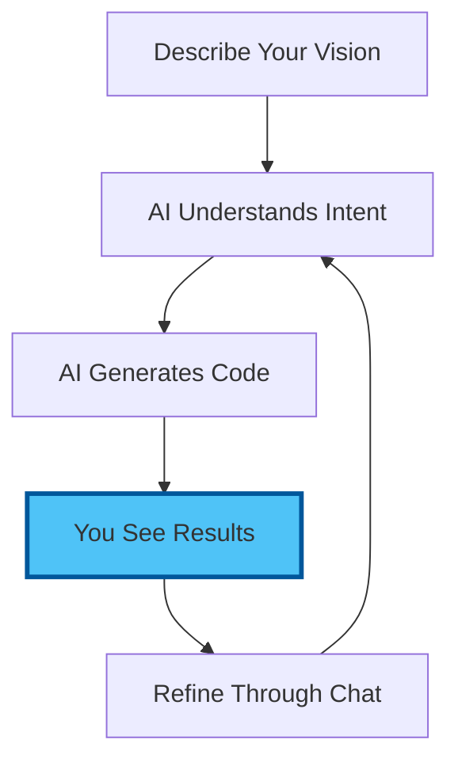
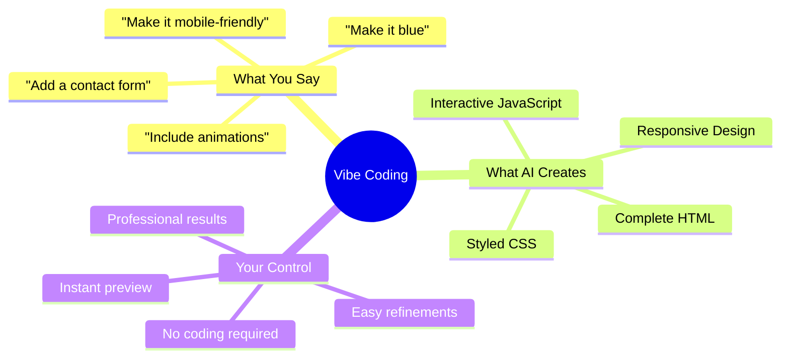
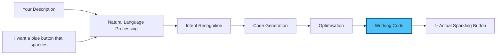
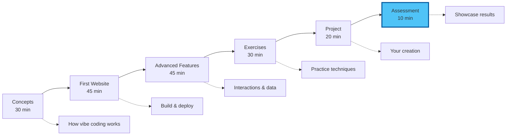
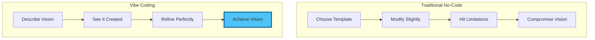
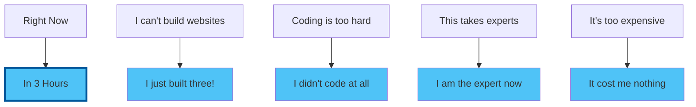

# Chapter 0: Introduction to Vibe Coding Mastery

## From Describing to Creating: The Magic of Conversational Programming

Welcome to the most transformative session of your journey! This afternoon, you'll discover "vibe coding"—the revolutionary approach where you describe what you want in plain language, and AI creates it. No programming knowledge required, just imagination.

## The Vibe Coding Revolution

### What Is Vibe Coding?

Vibe coding is the art of creating software, websites, and digital solutions through natural conversation with AI. Instead of learning syntax and programming languages, you simply:

### The Paradigm Shift

**Traditional Coding:**
- Years to learn languages
- Memorise syntax rules
- Debug cryptic errors
- Think like a computer

**Vibe Coding:**
- Describe in plain English
- AI handles syntax
- Conversational debugging
- Think like a human

## Why This Changes Everything

### Democratising Creation

For the first time in history, the ability to create digital solutions is limited only by imagination, not technical knowledge. Whether you're:

- **A Business Owner** wanting a custom dashboard
- **An Academic** needing interactive visualisations
- **A Consultant** creating client demonstrations
- **A Creative** building portfolio websites
- **Anyone** with an idea to bring to life

You can now build what you envision.

## What You'll Create This Afternoon

### Real, Working Applications

By the end of this session, you'll have built:

1. **A Professional Website**
   - Responsive design
   - Interactive elements
   - Modern aesthetics
   - Live on the internet

2. **Interactive Dashboards**
   - Data visualisations
   - Real-time updates
   - User interactions

3. **Custom Tools**
   - Calculators
   - Converters
   - Automation scripts

### All Through Conversation!

## The Science Behind the Magic

### How AI Understands Your Intent

### Why It Works So Well

1. **Context Understanding**: AI grasps your overall vision
2. **Pattern Recognition**: Knows common design patterns
3. **Best Practices**: Automatically applies modern standards
4. **Iterative Refinement**: Improves through conversation

## Success Stories from the Field

> "I described my dream portfolio site in 10 minutes of chatting. It would have cost me £5,000 to hire someone. Now it's live and I update it myself."
> — Lisa Park, Graphic Designer

> "Our team needed a custom calculator for client quotes. I 'vibed' it into existence in 30 minutes. It's been running flawlessly for months."
> — Robert Singh, Financial Consultant

> "I thought websites required coding. Now I build them during lunch breaks. My side business launched because of vibe coding."
> — Maria González, Teacher turned Entrepreneur

## Module Learning Journey

## What Makes Vibe Coding Different

### From Other "No-Code" Tools

**Drag-and-Drop Builders:**
- Limited templates
- Restrictive layouts
- Monthly fees
- Vendor lock-in

**Vibe Coding:**
- Unlimited possibilities
- Any design imaginable
- Own your code
- Deploy anywhere

### The Creative Freedom

## Prerequisites Check

Before we begin, ensure you have:
- [x] Completed the morning session (API setup)
- [x] VS Code with AI configured
- [x] A web browser for testing
- [x] An idea for what you want to create
- [x] Enthusiasm for bringing ideas to life

## Common Concerns Addressed

### "But I don't understand code!"
Perfect! You don't need to. You just need to describe what you want.

### "What if I want something complex?"
Complexity is just a conversation away. AI handles the technical parts.

### "Can I really deploy this professionally?"
Absolutely. The code created is production-ready and yours to own.

### "What are the limitations?"
Your imagination and ability to describe it. Seriously.

## The Transformation Ahead

### By End of This Afternoon

✅ **You'll have built** a real website or application  
✅ **It will be live** on the internet  
✅ **You'll know how** to build anything else  
✅ **You'll think differently** about what's possible  
✅ **You'll be unstoppable** in creating digital solutions  

## Your Instructor's Promise

This afternoon will be the moment you realise that the barrier between imagination and creation has fallen. What took teams of developers months to build, you'll create in minutes through conversation.

The future isn't about learning to code—it's about learning to communicate your vision clearly. And that's a skill you already have.

## The Magic Moment Awaits

## Ready to Vibe?

Forget everything you think you know about creating digital solutions. This afternoon, you'll discover that if you can describe it, you can build it. No exceptions.

Let's turn your ideas into reality!

---

Next: [Chapter 1: Core Concepts - Understanding Vibe Coding](./01_concepts.md)

[Back to Morning Session](../workshop-02-morning-ai-api-access/README.md) | [Skip to Building](./02_hands_on.md)
