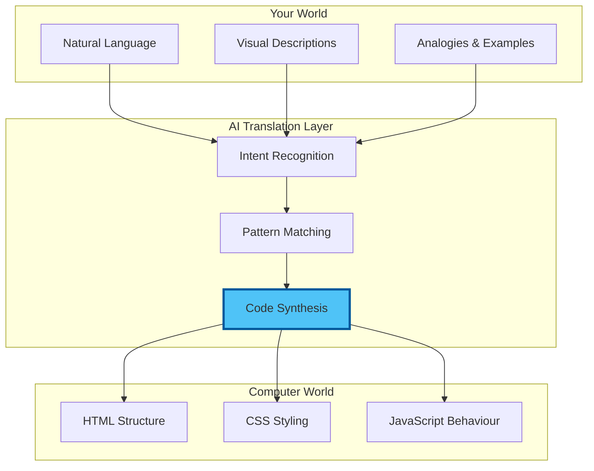
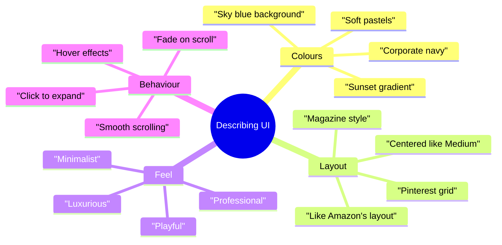
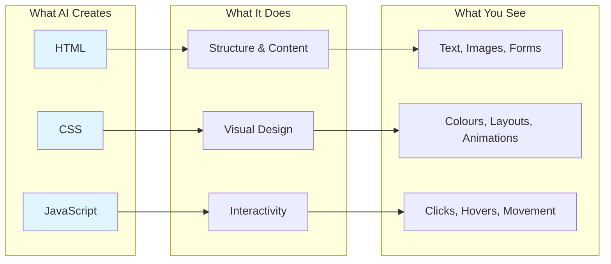
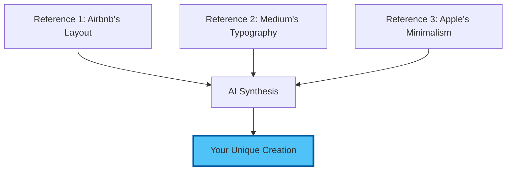
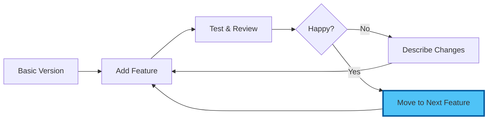
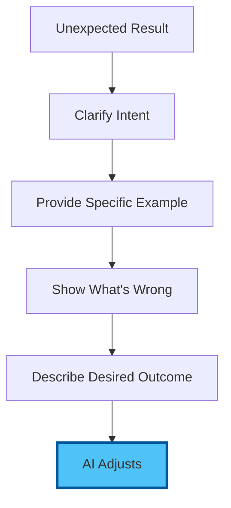
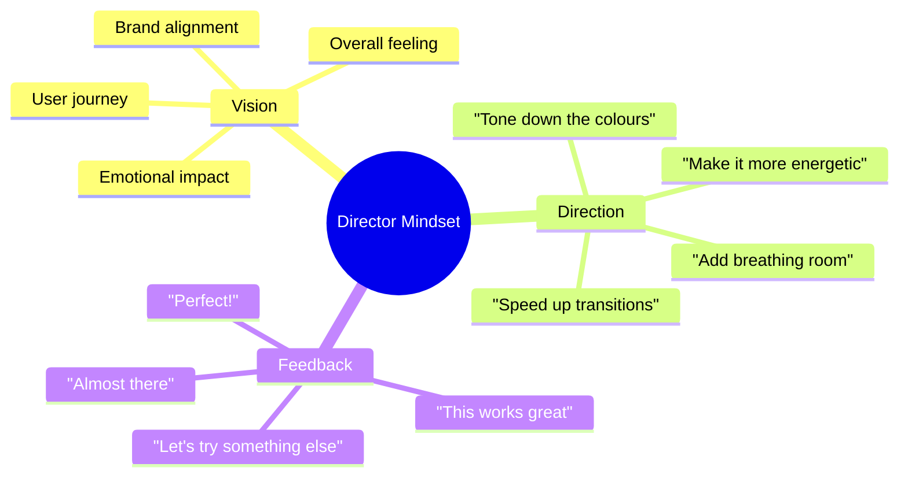

# Chapter 1: Core Concepts - Understanding Vibe Coding

## The Philosophy of Conversational Creation

Before we start building amazing things, let's understand the revolutionary concepts that make vibe coding possible. This knowledge will empower you to create anything you can imagine.

## 1.1 What Makes Vibe Coding Work?

### The Communication Bridge

Vibe coding works because modern AI has become fluent in translating human intent into computer instructions:



### The Three Pillars of Vibe Coding

1. **Descriptive Clarity**
   - Be specific about what you want
   - Use visual language
   - Reference examples

2. **Iterative Refinement**
   - Start simple
   - Build incrementally
   - Refine through dialogue

3. **Creative Collaboration**
   - AI as creative partner
   - You provide vision
   - AI handles implementation

## 1.2 The Language of Creation

### Effective Vibe Coding Vocabulary

Instead of technical terms, use descriptive language:

| Don't Say | Do Say |
|-----------|--------|
| "div with flexbox" | "arrange items in a row" |
| "border-radius 10px" | "rounded corners" |
| "onClick handler" | "when someone clicks this" |
| "responsive grid" | "adapts to phone screens" |
| "CSS animation" | "make it fade in smoothly" |

### Visual Descriptions That Work



## 1.3 The Anatomy of a Vibe Coding Session

### Phase 1: Vision Setting

Start with the big picture:

```
"I want to create a personal portfolio website that feels 
modern and professional, with a hero section, project 
gallery, and contact form. Think minimal Apple-style design."
```

### Phase 2: Structural Creation

AI generates the foundation:
- HTML structure
- Basic layout
- Core components

### Phase 3: Visual Refinement

Iterate on aesthetics:
```
"Make the hero text larger and add a subtle gradient. 
Can the project cards have a slight shadow on hover?"
```

### Phase 4: Interactive Enhancement

Add behaviour:
```
"When someone scrolls, fade in each section. 
Make the navigation stick to the top after scrolling past the hero."
```

### Phase 5: Polish & Deploy

Final touches and going live:
```
"Ensure it works perfectly on mobile. 
Add smooth transitions between all interactions."
```

## 1.4 Understanding What AI Creates

### The Three Languages of the Web

When you vibe code, AI generates three types of code:



You don't need to understand this code—just know it exists and works together.

## 1.5 The Power of Examples

### Reference-Based Creation

The most effective vibe coding uses references:

**Weak Prompt:**
```
"Make a nice website"
```

**Strong Prompt:**
```
"Create a landing page similar to Stripe's clean design, 
but for a yoga studio. Use calming colours and imagery."
```

### Combining Inspirations



## 1.6 Common Vibe Coding Patterns

### The Enhancement Loop



### Progressive Enhancement Strategy

1. **Start with Structure**
   - "Create a page with header, main content, footer"

2. **Add Visual Design**
   - "Style it with modern, clean aesthetics"

3. **Enhance Layout**
   - "Make it responsive with a mobile-first approach"

4. **Add Interactions**
   - "Include smooth scrolling and hover effects"

5. **Polish Details**
   - "Add subtle animations and loading transitions"

## 1.7 Debugging Through Conversation

### When Things Don't Look Right

Instead of technical debugging, use natural language:

**Issue**: Button doesn't look right
**Don't say**: "Fix the CSS padding and margin"
**Do say**: "The button feels cramped, give it more breathing room"

**Issue**: Layout breaks on mobile
**Don't say**: "Add media queries for responsive design"
**Do say**: "This looks weird on phones, make it stack vertically"

### The Clarification Technique

When AI misunderstands:



## 1.8 Advanced Vibe Coding Concepts

### Conditional Descriptions

"If the screen is small, stack everything vertically. 
On large screens, show three columns side by side."

### State-Based Behaviour

"When the form is submitted successfully, show a thank you message 
and hide the form. If there's an error, highlight the problem fields."

### Dynamic Content

"Load the project data from a list and create a card for each one. 
When clicked, expand to show more details."

## 1.9 The Mindset for Success

### Think Like a Director, Not a Developer



### Embrace Experimentation

- No change is permanent
- Try wild ideas
- Iterate quickly
- Trust the process

## 1.10 Real-World Applications

### What People Build with Vibe Coding

1. **Business Solutions**
   - Landing pages
   - Product showcases
   - Pricing calculators
   - Contact forms

2. **Personal Projects**
   - Portfolio sites
   - Blogs
   - Resume pages
   - Side businesses

3. **Tools & Utilities**
   - Converters
   - Generators
   - Dashboards
   - Trackers

4. **Creative Works**
   - Interactive stories
   - Art galleries
   - Music players
   - Games

## Key Takeaways

✅ **Vibe coding** translates natural language into working code  
✅ **Description beats prescription**—say what you want, not how  
✅ **Iteration is the key**—start simple, enhance gradually  
✅ **References help**—point to examples you like  
✅ **Conversation replaces debugging**—just explain the issue  
✅ **Anyone can do this**—no technical knowledge required  

## Mental Preparation

Before we start building:

1. **Forget** any coding fears
2. **Trust** the process
3. **Embrace** creative freedom
4. **Prepare** to be amazed
5. **Think** about what you want to create

## Your Creative Canvas Awaits

You now understand the principles that make vibe coding possible. In the next chapter, we'll put these concepts into practice and build your first creation through pure conversation.

Remember: You're not learning to code—you're learning to direct AI to bring your visions to life.

---

Next: [Chapter 2: Hands-On - Building Your First Vibe Creation](./02_hands_on.md)

[Back to Introduction](./00_introduction.md) | [Back to Module Overview](README.md)
