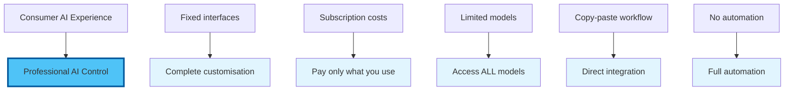
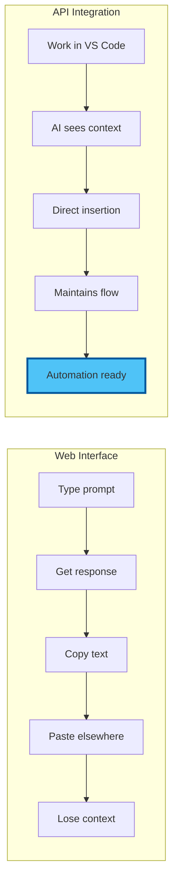
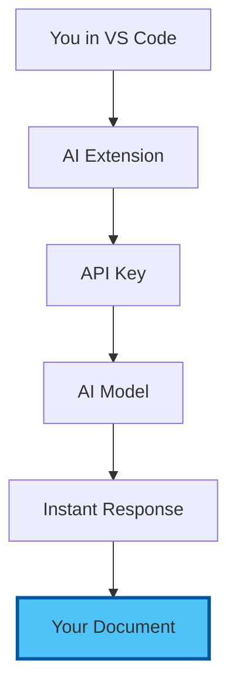
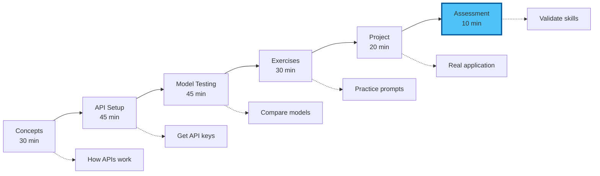
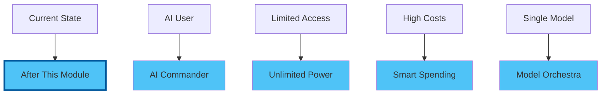

# Chapter 0: Introduction to Direct AI API Access

## Beyond ChatGPT: Unlock the Full Power of AI

Welcome to Day 2! This morning, you'll discover the difference between using AI as a consumer and commanding it as a professional. By connecting directly to AI APIs, you'll gain power, control, and cost savings that web interfaces simply can't match.

## The Revolution You're About to Join

Imagine having direct access to the world's most powerful AI models:

## Why Direct API Access Changes Everything

### The Hidden Truth About AI Costs

**Consumer Subscriptions:**
- ChatGPT Plus: £20/month
- Claude Pro: £18/month
- Gemini Advanced: £19/month
- **Total**: £57/month for limited access

**Direct API Access:**
- Average professional use: £3-5/month
- Access to ALL models
- No limits or throttling
- **10x cost reduction**

### The Power Difference

## What You'll Master This Morning

### 1. Multi-Model Mastery

Connect and compare the giants:

- **OpenAI GPT-4o**: Best for complex reasoning
- **Anthropic Claude 3.5**: Superior for writing and analysis
- **Google Gemini 1.5**: Massive context windows
- **Mistral & Llama**: Fast, cost-effective alternatives

### 2. API Fundamentals (No Coding Required!)

### 3. Cost Control & Management

- Understand token economics
- Set spending limits
- Monitor usage in real-time
- Optimise for efficiency

### 4. Advanced Capabilities

- Context window management
- Model-specific strengths
- Prompt optimisation
- Response streaming

## Real Success Stories

> "I was spending £60/month on AI subscriptions. Now I spend £4 and have access to better models. The math is simple."
> — James Chen, Marketing Director

> "Being able to switch between models based on the task is a superpower. Claude for writing, GPT-4 for analysis, Gemini for research."
> — Dr. Sarah Ahmed, Research Scientist

> "The direct integration into my workflow saves me 2 hours daily. No more tab switching and copy-pasting."
> — Michael Torres, Consultant

## Module Learning Path

## What Makes This Different

### Traditional AI Courses
- Theory-heavy explanations
- Focus on prompting techniques
- Limited to one platform
- Consumer-level access

### Our Approach
- Hands-on from minute one
- Multiple AI models compared
- Professional integration
- Enterprise-level control

## Prerequisites Check

Before we begin, ensure you have:
- [x] VS Code running from Module 05
- [x] Continue extension installed
- [x] Internet connection
- [x] Excitement for AI superpowers
- [x] A real project to enhance

## Common Concerns Addressed

### "I'm not technical enough"
If you can create an email account, you can get an API key. We'll walk through every click.

### "What about security?"
API keys are like passwords—keep them safe, and you're secure. We'll cover best practices.

### "Will I break something?"
No! APIs have limits and safeguards. You can't accidentally spend £1000 or break the internet.

### "Is this legal for my work?"
Yes! You're using the same models, just more efficiently. Check your organisation's AI policy as usual.

## The Transformation Ahead

### This Morning You'll Build:

1. **Multi-Model Command Centre**
   - Access to 5+ leading AI models
   - Instant model switching
   - Cost tracking dashboard

2. **Professional Workflows**
   - Document generation
   - Research assistance 
   - Content enhancement
   - Analysis automation

3. **Cost-Effective System**
   - 90% cost reduction
   - Better performance
   - No subscriptions

## Your Instructor's Promise

By the end of this morning session, you will:

✅ Have API access to multiple AI providers  
✅ Understand exactly what you're paying for  
✅ Switch between models like a pro  
✅ Create content 10x faster than before  
✅ Save hundreds of pounds annually  

## The Paradigm Shift Moment

Right now, you're like someone using a smartphone only for calls while it can do so much more. This morning, we unlock the full potential.

## Ready to Command AI Like a Pro?

This isn't about becoming more technical—it's about becoming more powerful. The same AI models that power billion-dollar companies are about to become your personal assistants.

Let's begin your transformation from AI consumer to AI commander!

---

Next: [Chapter 1: Core Concepts - Understanding AI APIs](./01_concepts.md)

[Back to Course Overview](../README.md) | [Skip to Hands-On](./02_hands_on.md)
