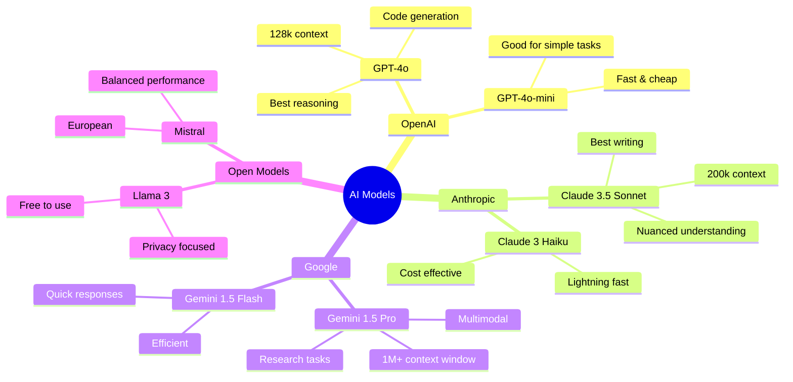
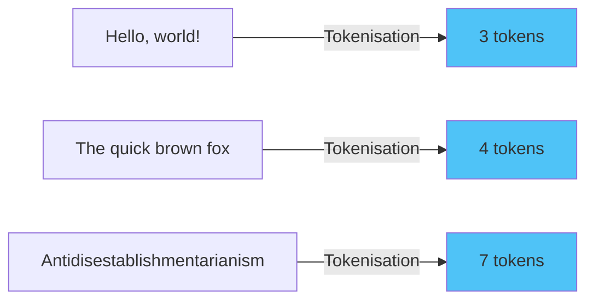
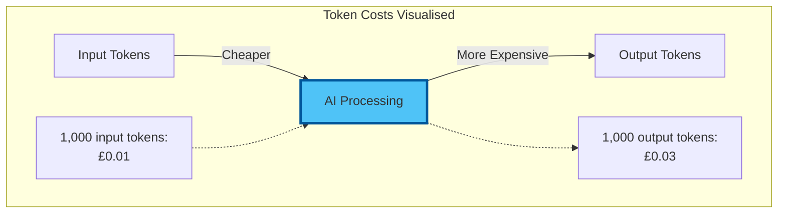
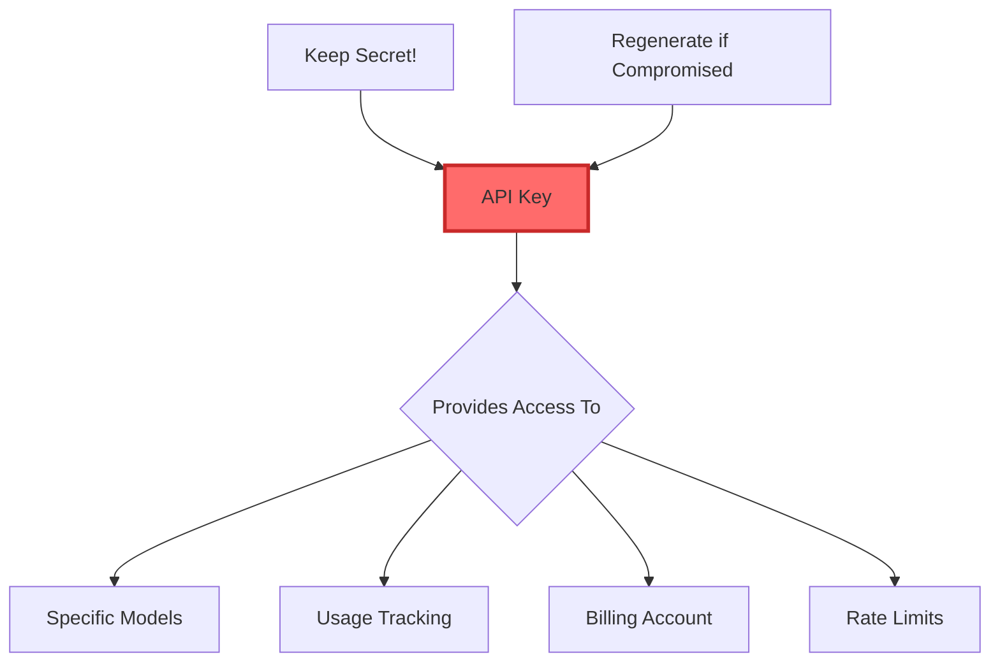
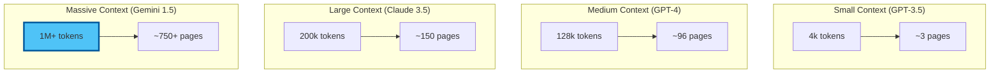
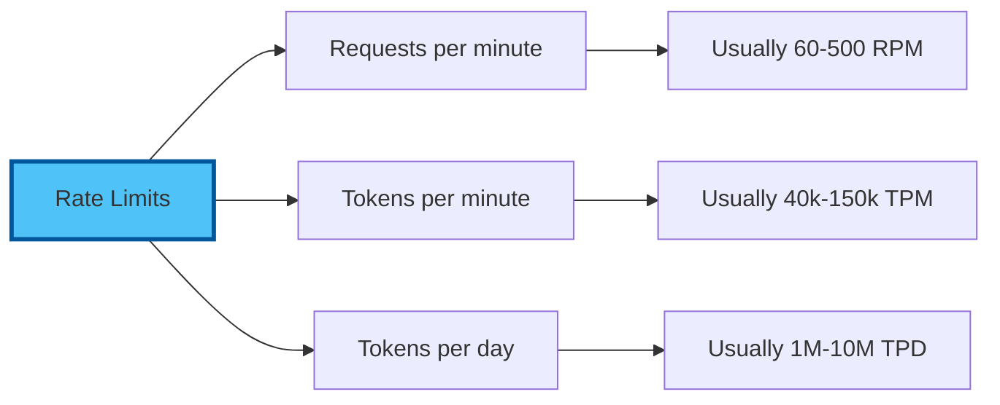
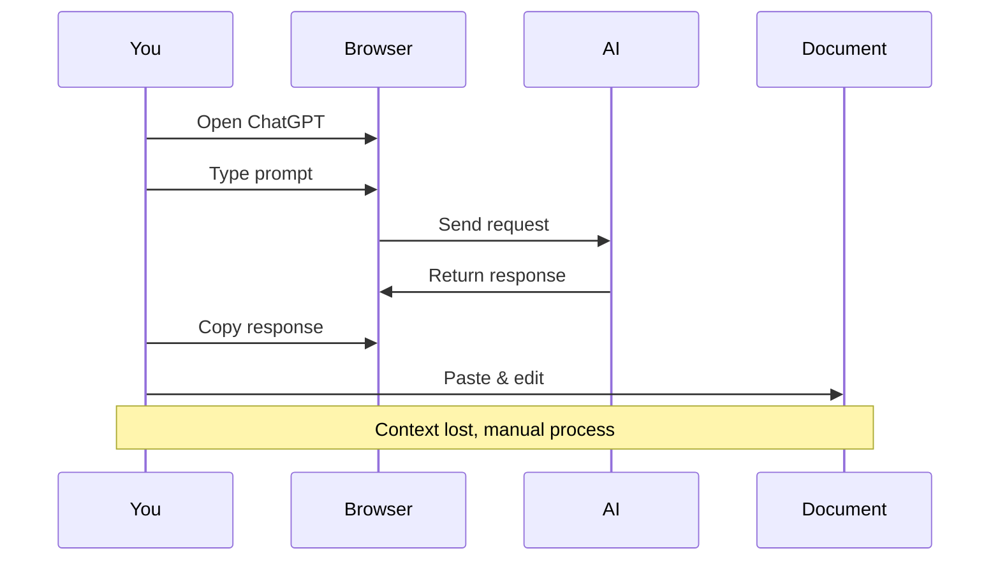
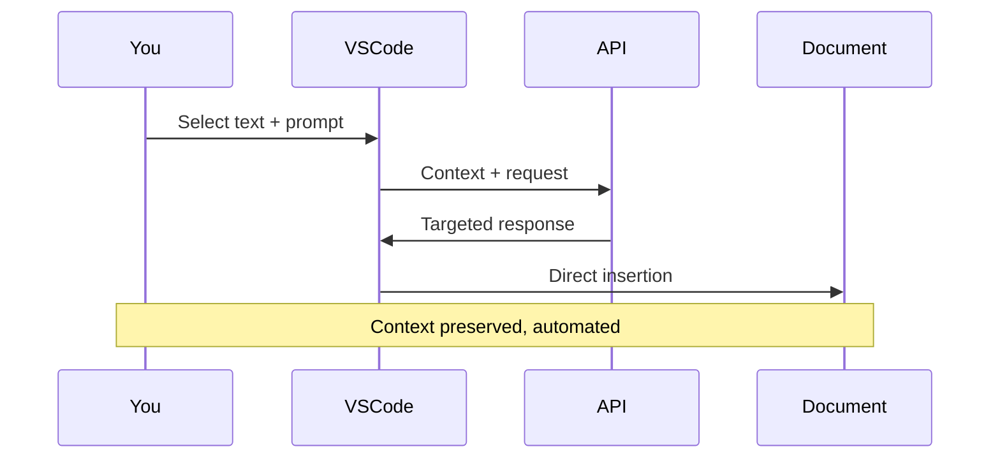
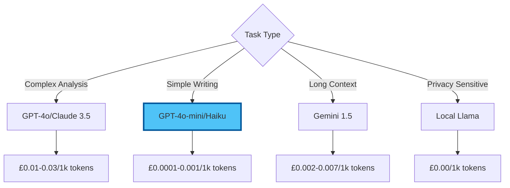
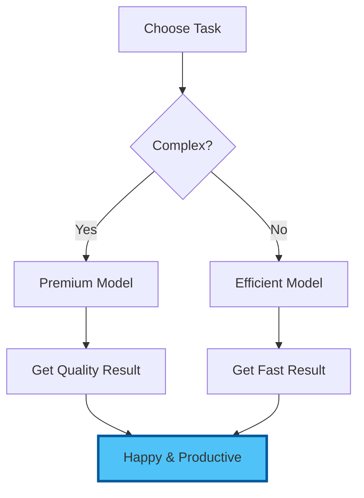

# Chapter 1: Core Concepts - Understanding AI APIs

## Demystifying the Technology That Powers AI

Before we connect to AI models, let's understand what's really happening behind the scenes. This knowledge will transform you from a passive user to an active commander of AI technology.

## 1.1 What Is an API?

### The Restaurant Analogy

Think of an API (Application Programming Interface) like a restaurant:

```mermaid
graph TD
    subgraph "Restaurant (API) Model"
        Customer[You] -->|Order<br/>(API Request)| Waiter[API]
        Waiter -->|Passes to| Kitchen[AI Model]
        Kitchen -->|Prepares| Food[Response]
        Food -->|Delivered by| Waiter2[API]
        Waiter2 -->|Serves| Customer2[You]
    end
    
    style Kitchen fill:#4fc3f7,stroke:#01579b,stroke-width:3px
```

- **You**: The customer wanting a service
- **Menu**: Available API endpoints and models
- **Waiter**: The API that takes your request
- **Kitchen**: The AI model processing your request
- **Food**: The response you receive

### Why This Matters

**Web Interface (ChatGPT/Claude.ai):**
- Fixed menu with no substitutions
- Eat only in the restaurant
- Pay expensive prix fixe pricing

**API Access:**
- Order anything you want
- Get delivery anywhere
- Pay only for what you order

## 1.2 Understanding AI Models

### The Model Landscape



### Model Strengths Comparison

| Model | Best For | Context Window | Cost | Speed |
|-------|----------|----------------|------|-------|
| GPT-4o | Complex reasoning, coding | 128k tokens | £££ | Medium |
| Claude 3.5 Sonnet | Writing, analysis | 200k tokens | £££ | Medium |
| Gemini 1.5 Pro | Research, long documents | 1M+ tokens | ££ | Fast |
| GPT-4o-mini | Simple tasks, drafts | 128k tokens | £ | Very Fast |
| Llama 3 70B | Privacy-sensitive work | 8k tokens | Free* | Fast |

*When self-hosted or via free providers

## 1.3 The Token Economy

### What Are Tokens?

Tokens are how AI models process text:



**Rule of Thumb:**
- 1 token ≈ 4 characters
- 1 token ≈ 0.75 words
- 1,000 tokens ≈ 750 words
- 1 page ≈ 500 tokens

### Understanding Costs



### Real-World Examples

**Email Generation (GPT-4o):**
- Input: 50 tokens (brief instruction)
- Output: 200 tokens (full email)
- Cost: £0.0035

**Document Analysis (Claude 3.5):**
- Input: 5,000 tokens (full document)
- Output: 500 tokens (summary)
- Cost: £0.021

**Monthly Comparison:**
- ChatGPT Plus: £20 (unlimited*)
- Typical API use: £3-5 (truly unlimited)

## 1.4 API Keys: Your Access Credentials

### What Is an API Key?

An API key is like a hotel room key:



### Security Best Practices

1. **Never Share Keys**
   - Treat like passwords
   - Don't put in public code
   - Don't email them

2. **Use Environment Variables**
   - Store securely in VS Code
   - Not in your documents
   - We'll set this up properly

3. **Set Spending Limits**
   - Start with £5/month
   - Monitor usage
   - Increase as needed

## 1.5 Context Windows Explained

### What Is a Context Window?

The context window is how much the AI can "see" at once:



### Practical Implications

**Small Context:**
- Quick questions
- Short documents
- Focused tasks

**Large Context:**
- Entire books
- Multiple documents
- Complex analysis
- Maintaining long conversations

## 1.6 Rate Limits and Quotas

### Understanding Limits

APIs have protective limits:



### What This Means for You

**Normal Use: Never Hit Limits**
- Writing documents: ✓
- Research tasks: ✓
- Content creation: ✓

**Might Hit Limits:**
- Processing 100s of documents rapidly
- Running automated workflows
- Solution: Use multiple models

## 1.7 The Integration Advantage

### Traditional Workflow



### API-Integrated Workflow



## 1.8 Cost Optimisation Strategies

### Smart Model Selection



### Practical Cost-Saving Tips

1. **Use Appropriate Models**
   - First draft: Cheap model
   - Final polish: Premium model

2. **Optimise Prompts**
   - Be concise but clear
   - Avoid redundant context

3. **Cache Common Responses**
   - Templates for repeated tasks
   - Reuse good outputs

4. **Monitor Usage**
   - Check daily spend
   - Identify expensive operations
   - Adjust accordingly

## 1.9 Provider Comparison

### Quick Decision Matrix

| Need | Best Provider | Model | Why |
|------|---------------|-------|-----|
| Best writing | Anthropic | Claude 3.5 Sonnet | Nuanced, natural prose |
| Complex reasoning | OpenAI | GPT-4o | Strong logical analysis |
| Long documents | Google | Gemini 1.5 Pro | 1M+ token context |
| Fast & cheap | OpenAI | GPT-4o-mini | Best bang for buck |
| Privacy | Local | Llama 3 | Runs on your machine |
| Code generation | OpenAI | GPT-4o | Excellent programming |

## Key Takeaways

✅ **APIs** are just restaurants where you order AI services  
✅ **Tokens** are the currency (1000 tokens ≈ 750 words)  
✅ **Different models** excel at different tasks  
✅ **Context windows** determine how much AI can process  
✅ **API keys** are your access credentials (keep safe!)  
✅ **Costs are 90% lower** than subscriptions  
✅ **Integration** beats copy-paste every time  

## Mental Model for Success



## Ready for Hands-On?

Now that you understand the concepts, let's set up your multi-model AI command centre. The next chapter will walk you through getting API keys and connecting everything in VS Code.

Remember: This isn't complex—it's just new. Every professional using AI started exactly where you are now.

---

Next: [Chapter 2: Hands-On API Setup](./02_hands_on.md)

[Back to Introduction](./00_introduction.md) | [Back to Module Overview](README.md)
