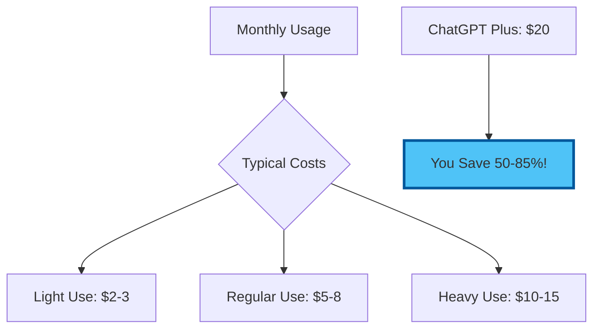
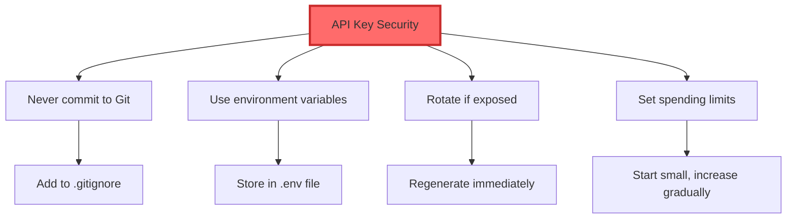
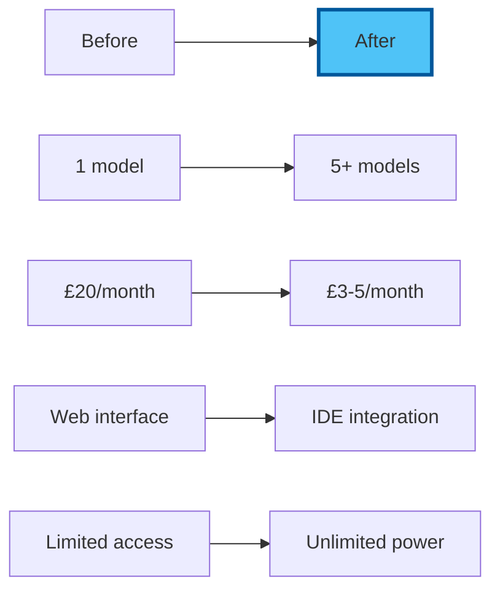

# Chapter 2: Hands-On API Setup - Building Your Multi-Model Command Centre

## Your 90-Minute Journey to AI Mastery

This hands-on session will transform you from an AI consumer to an AI commander. We'll set up access to multiple AI providers, configure everything in VS Code, and start saving money immediately.

## 2.1 Preparation Checklist

Before we begin, ensure you have:

- [x] VS Code open and running
- [x] Continue extension installed (from Module 05)
- [x] Internet browser ready
- [x] Email access for verifications
- [x] About 90 minutes of focused time

## 2.2 Getting Your First API Key (OpenAI)

### Why Start with OpenAI?

- Most mature API platform
- Excellent documentation
- Wide model selection
- Industry standard

### Step-by-Step OpenAI Setup

#### Step 1: Create OpenAI Account

1. **Navigate to**: https://platform.openai.com/signup
2. **Sign up** using email or Google account
3. **Verify** your email address
4. **Complete** profile information

#### Step 2: Navigate to API Keys

1. **Once logged in**, click your profile (top right)
2. **Select** "View API keys" or go to: https://platform.openai.com/api-keys
3. **You'll see** the API keys dashboard


#### Step 3: Create Your API Key

1. **Click** "Create new secret key"
2. **Name it** (e.g., "VS Code Integration")
3. **Important**: Copy the key immediately!
   ```
   sk-proj-abc123xyz... (example format)
   ```
4. **Save it** temporarily in a secure note

⚠️ **Critical**: You cannot view this key again after closing the window!

#### Step 4: Set Up Billing

1. **Navigate to** Billing settings
2. **Add payment method** (credit/debit card)
3. **Set monthly limit**: Start with $5-10
4. **Enable** usage alerts

### Cost Reality Check



## 2.3 Configuring OpenAI in VS Code

### Step 1: Open Continue Settings

1. **Click** Continue icon in sidebar (looks like `>>`)
2. **Click** the gear icon (settings)
3. **You'll see** `config.json` file open

### Step 2: Add OpenAI Configuration

```json
{
  "models": [
    {
      "title": "GPT-4o",
      "provider": "openai",
      "model": "gpt-4o",
      "apiKey": "YOUR_OPENAI_API_KEY_HERE"
    },
    {
      "title": "GPT-4o Mini",
      "provider": "openai",
      "model": "gpt-4o-mini",
      "apiKey": "YOUR_OPENAI_API_KEY_HERE"
    }
  ],
  "tabAutocompleteModel": {
    "title": "GPT-4o Mini",
    "provider": "openai",
    "model": "gpt-4o-mini",
    "apiKey": "YOUR_OPENAI_API_KEY_HERE"
  }
}
```

### Step 3: Test Your Connection

1. **Save** the config file
2. **Open** any text file
3. **Type**: "Hello AI"
4. **Select** the text
5. **Press** `Ctrl+I` (or `Cmd+I`)
6. **Choose** GPT-4o from the model dropdown
7. **Type**: "Respond with a friendly greeting"
8. **Success!** You should see a response

## 2.4 Adding Anthropic Claude

### Why Add Claude?

- Superior writing quality
- Larger context window (200k tokens)
- Different strengths than GPT
- More natural prose

### Step 1: Create Anthropic Account

1. **Navigate to**: https://console.anthropic.com
2. **Sign up** with email
3. **Verify** email address
4. **Complete** onboarding

### Step 2: Get Claude API Key

1. **Go to**: API Keys section
2. **Click**: "Create Key"
3. **Name it**: "VS Code Integration"
4. **Copy** the key:
   ```
   sk-ant-api03-abc123... (example format)
   ```

### Step 3: Add to VS Code Config

Add to your Continue config.json:

```json
{
  "title": "Claude 3.5 Sonnet",
  "provider": "anthropic",
  "model": "claude-3-5-sonnet-20241022",
  "apiKey": "YOUR_ANTHROPIC_API_KEY_HERE"
}
```

## 2.5 Adding Google Gemini

### Why Add Gemini?

- Massive context window (1M+ tokens)
- Free tier available
- Excellent for research
- Multimodal capabilities

### Step 1: Get Gemini API Key

1. **Navigate to**: https://makersuite.google.com/app/apikey
2. **Sign in** with Google account
3. **Click**: "Create API Key"
4. **Select**: "Create API key for new project"
5. **Copy** the key:
   ```
   AIzaSy... (example format)
   ```

### Step 2: Configure in VS Code

Add to Continue config:

```json
{
  "title": "Gemini 1.5 Pro",
  "provider": "gemini",
  "model": "gemini-1.5-pro-latest",
  "apiKey": "YOUR_GEMINI_API_KEY_HERE"
},
{
  "title": "Gemini 1.5 Flash",
  "provider": "gemini",
  "model": "gemini-1.5-flash-latest",
  "apiKey": "YOUR_GEMINI_API_KEY_HERE"
}
```

## 2.6 Adding Free/Open Models

### Option A: Groq (Recommended for Speed)

1. **Sign up at**: https://console.groq.com
2. **Get API key** from dashboard
3. **Add to config**:

```json
{
  "title": "Llama 3.1 70B (Groq)",
  "provider": "groq",
  "model": "llama-3.1-70b-versatile",
  "apiKey": "YOUR_GROQ_API_KEY_HERE"
}
```

### Option B: Together AI

1. **Sign up at**: https://api.together.xyz
2. **Get API key**
3. **Add multiple models**:

```json
{
  "title": "Mixtral 8x7B",
  "provider": "together",
  "model": "mistralai/Mixtral-8x7B-Instruct-v0.1",
  "apiKey": "YOUR_TOGETHER_API_KEY_HERE"
}
```

## 2.7 Complete Configuration

### Your Final config.json

Here's what your complete configuration should look like:

```json
{
  "models": [
    {
      "title": "GPT-4o",
      "provider": "openai",
      "model": "gpt-4o",
      "apiKey": "sk-proj-..."
    },
    {
      "title": "GPT-4o Mini",
      "provider": "openai",
      "model": "gpt-4o-mini",
      "apiKey": "sk-proj-..."
    },
    {
      "title": "Claude 3.5 Sonnet",
      "provider": "anthropic",
      "model": "claude-3-5-sonnet-20241022",
      "apiKey": "sk-ant-..."
    },
    {
      "title": "Gemini 1.5 Pro",
      "provider": "gemini",
      "model": "gemini-1.5-pro-latest",
      "apiKey": "AIza..."
    },
    {
      "title": "Llama 3.1 70B",
      "provider": "groq",
      "model": "llama-3.1-70b-versatile",
      "apiKey": "gsk_..."
    }
  ],
  "tabAutocompleteModel": {
    "title": "GPT-4o Mini",
    "provider": "openai",
    "model": "gpt-4o-mini",
    "apiKey": "sk-proj-..."
  },
  "allowAnonymousTelemetry": false,
  "embeddingsProvider": {
    "provider": "openai",
    "model": "text-embedding-3-small",
    "apiKey": "sk-proj-..."
  }
}
```

## 2.8 Testing Your Multi-Model Setup

### The Model Comparison Test

Create a new file `model-test.md`:

```markdown
# AI Model Comparison

## Test Prompt
Explain blockchain technology in exactly 3 sentences for a business executive.

### GPT-4o Response:
[Test here]

### Claude 3.5 Response:
[Test here]

### Gemini 1.5 Response:
[Test here]

### Llama 3.1 Response:
[Test here]
```

### Running the Test

1. **Select** the test prompt
2. **Press** `Ctrl+I`
3. **Choose** first model
4. **Submit** prompt
5. **Repeat** for each model
6. **Compare** results

### What to Look For

- **Clarity**: Which explains best?
- **Conciseness**: Who follows instructions?
- **Style**: Which tone do you prefer?
- **Speed**: Which responds fastest?

## 2.9 Cost Monitoring Setup

### OpenAI Usage Dashboard

1. **Visit**: https://platform.openai.com/usage
2. **View**: Daily costs
3. **Set**: Email alerts at 80% of limit

### Create a Cost Tracking Sheet

In VS Code, create `ai-costs.md`:

```markdown
# AI Usage Tracking

## Daily Costs
| Date | OpenAI | Anthropic | Google | Total |
|------|--------|-----------|--------|-------|
| Today | £0.00 | £0.00 | £0.00 | £0.00 |

## Model Performance Notes
- GPT-4o: Best for...
- Claude 3.5: Best for...
- Gemini 1.5: Best for...
- Llama 3.1: Best for...
```

## 2.10 Productivity Shortcuts

### Quick Model Switching

1. **Continue Panel**: Click model name to switch
2. **Keyboard**: `Ctrl+Shift+M` for model menu
3. **Default Model**: Set in config for common tasks

### Custom Prompts Setup

Add to your config:

```json
"customCommands": [
  {
    "name": "improve",
    "prompt": "Improve this text for clarity and professionalism",
    "description": "Enhance writing quality"
  },
  {
    "name": "summarize",
    "prompt": "Summarize this in 3 bullet points",
    "description": "Quick summary"
  },
  {
    "name": "explain",
    "prompt": "Explain this concept simply",
    "description": "ELI5 explanation"
  }
]
```

## 2.11 Security Best Practices

### Protecting Your API Keys



### Environment Variables (Advanced)

For better security, use `.env` file:

1. **Create** `.env` in project root
2. **Add** keys:
   ```env
   OPENAI_API_KEY=sk-proj-...
   ANTHROPIC_API_KEY=sk-ant-...
   ```
3. **Reference** in config:
   ```json
   "apiKey": "${OPENAI_API_KEY}"
   ```

## 2.12 Troubleshooting Common Issues

### "Invalid API Key"
- Check for extra spaces
- Ensure key is active
- Verify billing is set up

### "Rate Limit Exceeded"
- Wait a few minutes
- Switch to different model
- Check usage dashboard

### "Model Not Found"
- Update model names (they change)
- Check provider documentation
- Use latest Continue version

## Your Achievements Unlocked!

### You Now Have:

✅ **Multi-Model Access**: 5+ AI models at your fingertips  
✅ **Cost Control**: 90% savings vs subscriptions  
✅ **Direct Integration**: No more copy-paste  
✅ **Model Comparison**: Know which AI to use when  
✅ **Professional Setup**: Enterprise-grade configuration  

### Quick Stats



## Next Steps

With your multi-model command centre ready, let's put it to work! The exercises will show you how to leverage each model's strengths for maximum productivity.

### Pro Tips Before Moving On

1. **Bookmark** all provider dashboards
2. **Save** your config.json backup
3. **Test** each model with your real work
4. **Track** costs for first week
5. **Experiment** with different models

---

Next: [Chapter 3: Practical Exercises - Model Mastery](./03_exercises.md)

[Back to Concepts](./01_concepts.md) | [Back to Module Overview](README.md)
