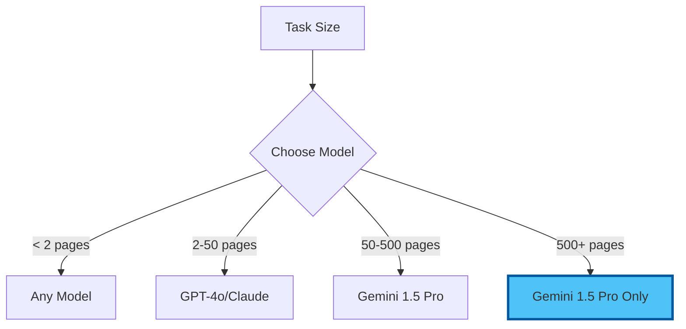

# Chapter 3: Practical Exercises - Model Mastery

## 30 Minutes to Multi-Model Expertise

These exercises will help you understand each AI model's unique strengths and build muscle memory for choosing the right tool for each task.

## Exercise 1: The Model Shootout (5 minutes)

### Objective
Compare how different models handle the same creative task.

### Setup
Create `creative-test.md`:

```markdown
# Creative Writing Test

## Prompt
Write a 50-word description of a rainy day that evokes emotion without using the words: rain, wet, water, or drops.
```

### Steps
1. **Select** the prompt
2. **Test each model**:
   - GPT-4o
   - Claude 3.5 Sonnet
   - Gemini 1.5 Pro
   - Llama 3.1
3. **Document** responses below each other
4. **Compare** for:
   - Creativity
   - Emotional impact
   - Following constraints
   - Writing style

### Expected Insights
- Claude often excels at creative writing
- GPT-4o may be more technically precise
- Gemini might offer unique perspectives
- Llama provides solid free alternative

## Exercise 2: Context Window Challenge (7 minutes)

### Objective
Test how different models handle long documents.

### Setup
1. **Create** `long-doc-test.md`
2. **Paste** a long document (3-5 pages)
3. **Add prompt** at the end:
   ```
   Summarise the key points from this document, 
   including specific details from the beginning, 
   middle, and end.
   ```

### Test Sequence
1. **GPT-4o**: Note any truncation warnings
2. **Claude 3.5**: Should handle full document
3. **Gemini 1.5 Pro**: Best for very long content
4. **Compare** comprehensiveness of summaries

### Learning Points
- When you need GPT-4o vs Gemini for long docs
- How context limits affect output quality
- Cost implications of long context

## Exercise 3: Speed vs Quality Test (5 minutes)

### Objective
Find the sweet spot between speed, quality, and cost.

### Task Types
Create `speed-test.md` with three tasks:

```markdown
# Speed vs Quality Comparison

## Task 1: Simple Email
Draft a professional email declining a meeting invitation.

## Task 2: Complex Analysis
Explain the pros and cons of remote work for businesses.

## Task 3: Code Generation
Write a Python function to calculate compound interest.
```

### Testing Matrix
| Task | GPT-4o-mini | GPT-4o | Claude 3.5 | Your Rating |
|------|-------------|--------|------------|-------------|
| Email | [Test] | [Test] | [Test] | Speed/Quality/Cost |
| Analysis | [Test] | [Test] | [Test] | Speed/Quality/Cost |
| Code | [Test] | [Test] | [Test] | Speed/Quality/Cost |

### Key Findings
Document when to use:
- Fast models (mini versions)
- Premium models (GPT-4o/Claude)
- Balanced options

## Exercise 4: Multi-Model Workflow (8 minutes)

### Objective
Build a workflow using different models for their strengths.

### Scenario: Research Report Creation

1. **Research Phase** (Gemini 1.5 Pro)
   ```
   Prompt: Research and summarise current trends in [your industry]
   ```

2. **Outline Phase** (GPT-4o)
   ```
   Prompt: Create a detailed outline for a report on these trends
   ```

3. **Writing Phase** (Claude 3.5)
   ```
   Prompt: Write the introduction section based on this outline
   ```

4. **Review Phase** (GPT-4o-mini)
   ```
   Prompt: Proofread and suggest improvements
   ```

### Document Your Workflow
```markdown
# My Multi-Model Workflow

## Best Models for Each Stage:
- Research: [Your choice] because...
- Structure: [Your choice] because...
- Writing: [Your choice] because...
- Editing: [Your choice] because...
```

## Exercise 5: Cost Optimisation Practice (5 minutes)

### Objective
Learn to minimise costs while maintaining quality.

### Create Cost Comparison
`cost-analysis.md`:

```markdown
# Cost Analysis Exercise

## Task: Generate a 500-word blog post about productivity

### Approach 1: All Premium
- Model: GPT-4o
- Estimated tokens: 1,000 in + 700 out
- Cost: £[calculate]

### Approach 2: Smart Mix
- Outline: GPT-4o-mini (200 tokens)
- First draft: GPT-4o-mini (800 tokens)
- Polish: Claude 3.5 (500 tokens)
- Total cost: £[calculate]

### Approach 3: Free Options
- Model: Llama 3.1 via Groq
- Cost: £0.00
- Quality comparison: [test and note]
```

### Calculate Real Savings
- Premium only: £___
- Smart mix: £___
- Savings: ___%

## Challenge Exercise: Your Custom Comparison

### Create Your Test Suite
Based on your actual work needs:

1. **Identify** 3 common tasks you do
2. **Create** test prompts for each
3. **Test** across all models
4. **Document** which model wins for each task
5. **Calculate** monthly cost savings

### Template
```markdown
# My Personal Model Preferences

## Task 1: [Your Task]
- Best Model: [...]
- Why: [...]
- Monthly savings: £[...]

## Task 2: [Your Task]
- Best Model: [...]
- Why: [...]
- Monthly savings: £[...]

## Task 3: [Your Task]
- Best Model: [...]
- Why: [...]
- Monthly savings: £[...]

## Total Monthly Savings: £[...]
```

## Exercise Reflection

### Quick Assessment
After completing exercises, you should know:

- [ ] Which model writes most naturally
- [ ] Which model handles long documents best
- [ ] When to use expensive vs cheap models
- [ ] How to combine models effectively
- [ ] Your potential monthly savings

### Key Insights Template
```markdown
# My AI Model Insights

## Writing Tasks
Best model: ___ because ___

## Analysis Tasks  
Best model: ___ because ___

## Long Documents
Best model: ___ because ___

## Quick Tasks
Best model: ___ because ___

## My Monthly AI Budget
Old way (subscriptions): £___
New way (APIs): £___
Savings: £___ (___%)
```

## Pro Tips from Exercises

1. **Claude 3.5** often wins for natural writing
2. **GPT-4o** excels at logical analysis
3. **Gemini 1.5** is unbeatable for long documents
4. **Mini models** are perfect for simple tasks
5. **Mixing models** optimises cost/quality

## Common Patterns Discovered

### The 80/20 Rule
- 80% of tasks need only cheap models
- 20% benefit from premium models
- Result: 70%+ cost savings

### The Context Ladder


## Your New Superpower

You can now:
- Choose the perfect model for any task
- Save 70-90% on AI costs
- Get better results than subscription users
- Work with documents of any size
- Optimise for speed or quality as needed

---

Next: [Chapter 4: Real Project - Multi-Model Magic](./04_project.md)

[Back to Hands-On](./02_hands_on.md) | [Back to Module Overview](README.md)
