# 2. Installation and Setup

This document outlines how to set up the Workshop Builder. The recommended method is using Docker, which provides a consistent and secure environment.

## Installation and Setup (Docker - Recommended)

Running Workshop Builder inside a Docker container is the recommended method for security, consistency, and ease of setup. This leverages a standard Python base image with enterprise-level security enhancements.

```mermaid
graph TB
    %% Host System
    subgraph HOST [🖥️ Host System]
        direction TB
        USER[👤 Developer]
        SCRIPTS[📜 Docker Scripts<br/>build-docker.sh<br/>run-docker.sh]
        COMPOSE[🐳 docker-compose.yml]
        ENV[🔐 .env Configuration]
    end
    
    %% Docker Infrastructure
    subgraph DOCKER [🐳 Docker Infrastructure]
        direction TB
        
        %% Build Process
        subgraph BUILD [🔨 Multi-Stage Build]
            direction LR
            BUILDER[🏗️ Builder Stage<br/>Dependencies & Tools]
            PROD[🚀 Production Stage<br/>Optimized Runtime]
            BUILDER --> PROD
        end
        
        %% Security Layer
        subgraph SECURITY [🔒 Security Layer]
            direction TB
            NONROOT[👤 Non-root User<br/>workshop-user:1000]
            CAPS[🛡️ Capability Restrictions<br/>--cap-drop=ALL]
            READONLY[📁 Read-only Filesystem<br/>Secure tmpfs]
            LIMITS[⚡ Resource Limits<br/>Memory: 2GB, CPU: 1.0]
        end
        
        %% Runtime Container
        CONTAINER[📦 Workshop Builder Container<br/>Secure Runtime Environment]
    end
    
    %% External Services
    subgraph EXTERNAL [🌐 External Services]
        direction TB
        GEMINI[🧠 Gemini Flash 2.5]
        OPENAI[🤖 OpenAI API]
        GITHUB[🔗 GitHub API]
    end
    
    %% File System
    subgraph FILESYSTEM [📁 File System]
        direction TB
        WEBSITE[📂 Website Repository<br/>Mounted Volume]
        WORKSHOPS[📚 Generated Workshops<br/>public/data/workshops/]
        WEBSITE --> WORKSHOPS
    end
    
    %% Flow Connections
    USER --> SCRIPTS
    USER --> COMPOSE
    SCRIPTS --> BUILD
    COMPOSE --> BUILD
    ENV -.->|Configuration| CONTAINER
    
    BUILD --> SECURITY
    SECURITY --> CONTAINER
    
    CONTAINER -.->|API Calls| EXTERNAL
    CONTAINER -.->|File Operations| FILESYSTEM
    
    %% Styling
    classDef host fill:#e3f2fd,stroke:#1976d2,stroke-width:2px
    classDef docker fill:#fff3e0,stroke:#f57c00,stroke-width:2px
    classDef security fill:#e8f5e8,stroke:#388e3c,stroke-width:2px
    classDef external fill:#fce4ec,stroke:#c2185b,stroke-width:2px
    classDef filesystem fill:#f3e5f5,stroke:#7b1fa2,stroke-width:2px
    
    class HOST,USER,SCRIPTS,COMPOSE,ENV host
    class DOCKER,BUILD,BUILDER,PROD,CONTAINER docker
    class SECURITY,NONROOT,CAPS,READONLY,LIMITS security
    class EXTERNAL,GEMINI,OPENAI,GITHUB external
    class FILESYSTEM,WEBSITE,WORKSHOPS filesystem
```



### Prerequisites

1.  **Docker:** Install Docker Desktop (Windows, macOS) or Docker Engine (Linux). Visit [docker.com](https://www.docker.com/) for instructions.
2.  **Git:** Required for cloning the project.
3.  **API Keys:** You will still need:
    *   Google Gemini Flash 2.5 API Key
    *   OpenAI API Key
    *   GitHub Personal Access Token (PAT)

### Setup Steps

1.  **Clone the Repository:**
    ```bash
    git clone <repository_url> # e.g., git clone https://github.com/your-org/website.git
    cd website/workshop-builder
    # Or cd website and then run scripts from workshop-builder
    ```

2.  **Configure Environment Variables:**
    *   Navigate to the `workshop-builder` directory.
    *   Copy the example environment file:
        ```bash
        cp .env.example .env
        ```
    *   Edit the `.env` file and fill in all your API keys and GitHub repository details:
        ```env
        GEMINI_API_KEY="your_gemini_api_key_here"
        OPENAI_API_KEY="your_openai_api_key_here"
        GITHUB_TOKEN="your_github_token_here"
        GITHUB_REPO_OWNER="your_github_username_or_org" # e.g., the owner of the 'website' repo
        GITHUB_REPO_NAME="your_repository_name"       # e.g., 'website'
        # ... other settings can usually remain default
        ```
        **Important:** `WORKSHOPS_BASE_DIR` is typically `../public/data/workshops`. This path will be relative to the `workshop-builder` directory *inside* the container's `/app` mount.

3.  **Build the Docker Image:**
    From the `workshop-builder` directory, run the enhanced build script:
    ```bash
    ./build-docker.sh
    ```
    This enhanced script includes:
    - Multi-stage Docker builds for optimized image size
    - Security scanning with Trivy (if available)
    - Comprehensive validation and error handling
    - Build cache management and cleanup
    - Professional logging with colored output

4.  **Run Workshop Builder:**
    
    **Option A: Enhanced Run Script (Recommended)**
    ```bash
    ./run-docker.sh --topic "Your Desired Workshop Topic" --verbose
    ```
    
    **Option B: Docker Compose (Development)**
    ```bash
    # For production use
    docker-compose up workshop-builder
    
    # For development with debug features
    docker-compose --profile dev up workshop-builder-dev
    ```
    
    **Enhanced Features:**
    - Security hardening with non-root user and capability restrictions
    - Resource limits (2GB memory, 1 CPU by default)
    - Comprehensive environment validation
    - Professional error handling and logging
    - Health checks and monitoring
    - Secure temporary filesystem with tmpfs

### Enhanced Docker Features

The Workshop Builder Docker implementation includes enterprise-level security and operational features:

#### Security Enhancements
- **Non-root execution**: Container runs as `workshop-user` (UID 1000) for security
- **Capability restrictions**: Minimal Linux capabilities with `--cap-drop=ALL`
- **Read-only filesystem**: Root filesystem is read-only with secure tmpfs for temporary files
- **Resource limits**: Memory (2GB) and CPU (1.0) limits prevent resource exhaustion
- **Security scanning**: Trivy integration for vulnerability detection (if available)

#### Operational Features
- **Multi-stage builds**: Optimized image size with separate builder and production stages
- **Health checks**: Container health monitoring with Python validation
- **Comprehensive logging**: Colored output with detailed error reporting
- **Environment validation**: Pre-flight checks for configuration and dependencies
- **Build cache management**: Efficient Docker layer caching and cleanup

#### Advanced Usage Options

**Run Script Options:**
```bash
# Standard usage with resource limits
./run-docker.sh --topic "Advanced Docker" --verbose

# Disable resource limits for large workshops
./run-docker.sh --no-limits --topic "Complex Topic"

# Debug mode with verbose Docker output
./run-docker.sh --debug --topic "Test Topic"

# Custom resource limits
./run-docker.sh --memory 4g --cpu 2.0 --topic "Resource Intensive Topic"
```

**Docker Compose Profiles:**
```bash
# Production deployment
docker-compose up workshop-builder

# Development with debugging tools
docker-compose --profile dev up workshop-builder-dev

# Background execution
docker-compose up -d workshop-builder
```

### Verifying Installation

After running a command like `./run-docker.sh --help`, you should see the CLI help output with enhanced features. A successful workshop generation run will output the PR URL.

**Verification Commands:**
```bash
# Test basic functionality
./run-docker.sh --help

# Verify security features
docker run --rm workshop-builder-app:latest whoami
# Should output: workshop-user

# Check resource limits
docker stats workshop-builder-dev
```

The `codex` CLI and its dependencies (Node.js, Python) are no longer required for the core AI functionality, as the system now uses direct OpenAI API calls.

## Alternative Setup (Manual / Virtual Environment)

This section guides you through the steps required to install and configure the Workshop Builder CLI tool with **OpenAI API integration** on your local machine manually. This is generally for development or debugging purposes outside of Docker.

### Prerequisites (Manual Setup)

Before you begin, ensure you have the following installed and configured:

### Core Requirements

1.  **Python:** Version 3.10 or higher is required for OpenAI API compatibility. Download from [python.org](https://www.python.org/).
2.  **Git:** Required for professional version control operations and GitHub integration. Download from [git-scm.com](https://git-scm.com/).

### API Access Requirements

3.  **Required API Keys and Tokens:**
    *   **Google Gemini Flash 2.5 API Key:** For advanced research capabilities. Obtain from [Google AI Studio](https://aistudio.google.com/) or Google Cloud Console.
    *   **OpenAI API Key:** **REQUIRED** for direct OpenAI API integration. Obtain from [OpenAI Platform](https://platform.openai.com/).
    *   **GitHub Personal Access Token (PAT):** For professional GitHub workflow automation. Generate from GitHub Developer Settings with `repo`, `pull_request`, and `workflow` scopes.

## Installation Steps (Manual Setup)

1.  **Clone the Repository:**
    Open your terminal and clone the repository containing the Workshop Builder project (assuming this project itself is hosted on GitHub).
    ```bash
    git clone <repository_url> # Replace <repository_url> with the actual URL
    cd workshop-builder
    ```

2.  **Create a Python Virtual Environment (Recommended):**
    It's best practice to use a virtual environment to manage project dependencies.
    ```bash
    python -m venv .venv
    ```
    Activate the virtual environment:
    *   On macOS and Linux:
        ```bash
        source .venv/bin/activate
        ```
    *   On Windows:
        ```bash
        .venv\Scripts\activate
        ```

3.  **Install Python Dependencies:**
    Install the required Python packages for OpenAI API integration:
    ```bash
    pip install -r requirements.txt
    ```
    Key dependencies include:
    -   `python-dotenv`: Environment variable management
    -   `PyGithub`: Professional GitHub API integration
    -   `google-generativeai`: Gemini Flash 2.5 API client
    -   `openai`: Official OpenAI Python client for direct API calls
    -   `requests`: HTTP client for API communications
    -   `Jinja2`: Professional template rendering
    -   `click`: Advanced CLI interface framework

4.  **Configure OpenAI API Environment:**
    The Workshop Builder requires comprehensive environment configuration for OpenAI API integration.
    -   Locate the example environment file: [`workshop-builder/.env.example`](../.env.example).
    -   Create your configuration file:
        ```bash
        cp .env.example .env
        ```
    -   **REQUIRED:** Fill in all required values in the `.env` file:
        ```env
        # CORE API KEYS (REQUIRED)
        GEMINI_API_KEY="your_gemini_flash_25_api_key"
        OPENAI_API_KEY="your_openai_api_key"
        GITHUB_TOKEN="your_github_pat_with_repo_scope"
        
        # GITHUB REPOSITORY (REQUIRED)
        GITHUB_REPO_OWNER="your_github_username"
        GITHUB_REPO_NAME="your_workshop_repository"
        
        # OPENAI API CONFIGURATION
        OPENAI_MODEL=gpt-4o
        OPENAI_MAX_TOKENS=4000
        OPENAI_TEMPERATURE=0.1
        
        # AGENTS.MD SUPPORT
        AGENTS_MD_ENABLED=true
        AGENTS_MD_PATH=AGENTS.MD
        
        # PROFESSIONAL ERROR HANDLING
        ERROR_RECOVERY_ENABLED=true
        MAX_RETRY_ATTEMPTS=3
        FALLBACK_GENERATION_ENABLED=true
        
        # PROFESSIONAL OUTPUT STANDARDS
        PROFESSIONAL_FORMATTING=true
        COMPREHENSIVE_VALIDATION=true
        METADATA_TRACKING=true
        ```

5.  **Validate OpenAI API Configuration:**
    Test your configuration to ensure proper OpenAI API integration:
    ```bash
    # Test configuration loading
    python orchestrator/config.py
    
    # Verify OpenAI API integration
    python -c "
    from orchestrator.config import AppConfig
    config = AppConfig()
    print('OpenAI API Key Set:', 'SUCCESS' if config.openai_api_key else 'FAILED')
    print('OpenAI Model:', config.openai_model)
    "
    ```

## Verifying OpenAI API Integration

Once the setup is complete, perform comprehensive verification of the OpenAI API integration:

### 1. Basic CLI Verification
```bash
python cli.py --help
```
This should display the command-line options.

### 2. API Connectivity Test
```bash
# Test Gemini Flash 2.5 API connectivity
python -c "
import google.generativeai as genai
import os
genai.configure(api_key=os.getenv('GEMINI_API_KEY'))
print('✓ Gemini Flash 2.5 API connection verified')
"

# Test OpenAI API connectivity
python -c "
import openai
import os
openai.api_key = os.getenv('OPENAI_API_KEY')
client = openai.OpenAI(api_key=os.getenv('OPENAI_API_KEY'))
client.models.list() # A simple call to verify connectivity
print('✓ OpenAI API connection verified')
"
```

### 3. Comprehensive System Validation
```bash
# Run comprehensive configuration validation
python orchestrator/config.py

# Test all agent initialization
python -c "
from orchestrator.orchestrator import Orchestrator
from orchestrator.config import AppConfig
config = AppConfig()
orchestrator = Orchestrator(config)
print('✓ OpenAI API integration validated')
print('✓ All agents initialized successfully')
print('✓ Professional error handling enabled')
print('✓ AGENTS.MD support configured')
"
```

### 4. GitHub Integration Test
```bash
# Test GitHub API connectivity
python -c "
from github import Github
import os
g = Github(os.getenv('GITHUB_TOKEN'))
user = g.get_user()
print(f'✓ GitHub API connection verified for user: {user.login}')
"
```

## Troubleshooting

### Common Issues and Solutions

**API Authentication Failures:**
- Verify API keys are correctly set in `.env`
- Ensure OpenAI API key has appropriate permissions
- Check GitHub token has required scopes (`repo`, `pull_request`, `workflow`)

**Configuration Validation Errors:**
```bash
# Check environment variable loading
python -c "
from dotenv import load_dotenv
import os
load_dotenv()
print('OPENAI_API_KEY:', 'SET' if os.getenv('OPENAI_API_KEY') else 'MISSING')
print('GEMINI_API_KEY:', 'SET' if os.getenv('GEMINI_API_KEY') else 'MISSING')
print('GITHUB_TOKEN:', 'SET' if os.getenv('GITHUB_TOKEN') else 'MISSING')
"
```

## Success Confirmation

When all verification steps pass, you should see:
- ✓ All API connections verified
- ✓ Configuration validation successful
- ✓ Agent initialization complete
- ✓ Professional error handling enabled

**You are now ready to use the Workshop Builder with full OpenAI API integration!**

Next: [Core Concepts & System Architecture](./03_core_concepts_architecture.md)