# 3. Core Concepts & System Architecture

Understanding the core concepts and architecture of Workshop Builder is key to using and extending it effectively. The system is built on **OpenAI API integration** principles for professional AI agent orchestration.

## Core Concepts

1.  **OpenAI API Integration:** Workshop Builder is built from the ground up to leverage the OpenAI API, providing advanced AI reasoning, professional output standards, and comprehensive error handling throughout the system.

2.  **Multi-Agent Orchestration:** Workshop Builder operates as a sophisticated system of specialized AI agents, each responsible for a distinct phase of the workshop creation pipeline. This modular design follows best practices for agent coordination and communication.

3.  **Topic-Driven Generation with Deep Research:** The entire process is initiated by providing a single "topic" string. The system then conducts comprehensive research using Gemini Flash 2.5's deep research capabilities before generating structured workshop content.

4.  **Advanced AI-Powered Transformation:** A core principle is the transformation of extensive research data into highly structured, professional-grade educational content using direct OpenAI API integration (specifically the Chat Completions API) with sophisticated prompt engineering.

5.  **AGENTS.MD Guidance System:** The system implements comprehensive AGENTS.MD files throughout the codebase, providing project-specific AI guidance and review processes.

6.  **Professional Template-Based Standardization:** All generated files follow enterprise-level standards using advanced Jinja2 templates with comprehensive metadata, validation, and professional formatting.

7.  **Automated Professional Git Workflow:** The system implements a sophisticated Git workflow with professional PR creation, comprehensive descriptions, proper labeling, and integration with existing workshop infrastructure.

8.  **Comprehensive Error Handling:** Robust error management with proper cascading, recovery mechanisms, and detailed logging throughout the entire pipeline.

## System Architecture Overview

The Workshop Builder follows a pipeline architecture where data flows sequentially through different agents.

```mermaid
graph TB
    %% User Input and Orchestration
    A[🎯 User CLI Input<br/>Topic String] --> B{🎭 Orchestrator}
    
    %% Research Phase
    B -->|Initialize Research| C[🔍 ResearchAgent<br/>Gemini Flash 2.5]
    C -->|Deep Research Query| C1[🌐 Gemini API]
    C1 -->|Research Data| C2[📄 Raw Data Files<br/>Temporary Storage]
    
    %% Compilation Phase
    B -->|Initialize Compilation| D[⚙️ CompilerAgent<br/>OpenAI API]
    C2 -->|Research Input| D
    D -->|OpenAI API Integration| D1[🤖 OpenAI Chat Completions API]
    D1 -->|Generated Content| D2[📚 Workshop Module<br/>Structured Files]
    
    %% Template Processing
    D -->|Template Rendering| T[📋 Jinja2 Templates]
    T -->|manifest.json & README.md| D2
    
    %% Git Workflow
    B -->|Initialize Git Workflow| E[📦 GitAgent<br/>GitHub Integration]
    D2 -->|Module Files| E
    E -->|Branch & Commit| E1[🔗 GitHub API]
    E1 -->|Professional PR| F[🎉 Pull Request<br/>Ready for Review]
    
    %% Styling
    classDef userInput fill:#e1f5fe,stroke:#01579b,stroke-width:2px
    classDef orchestrator fill:#f3e5f5,stroke:#4a148c,stroke-width:2px
    classDef agent fill:#e8f5e8,stroke:#1b5e20,stroke-width:2px
    classDef api fill:#fff3e0,stroke:#e65100,stroke-width:2px
    classDef output fill:#fce4ec,stroke:#880e4f,stroke-width:2px
    
    class A userInput
    class B orchestrator
    class C,D,E agent
    class C1,D1,E1 api
    class C2,D2,T,F output
```

**Components:**

*   **CLI (`cli.py`):** The command-line interface that accepts user input and initializes the OpenAI API-based orchestration system.

*   **Orchestrator (`orchestrator/orchestrator.py`):** The central coordinator that manages the entire workflow with:
    - Professional logging and output formatting
    - Comprehensive error handling with cascading recovery
    - Agent coordination following best practices
    - Integration with existing workshop infrastructure

*   **Configuration (`orchestrator/config.py`):** Advanced configuration management loading API keys, paths, and OpenAI API settings from environment variables.

*   **Specialized AI Agents (`agents/`):**
    *   **`ResearchAgent`:** Advanced research engine with actual Gemini Flash 2.5 API integration:
        - Deep research capabilities with comprehensive data gathering
        - Professional error handling and API rate limiting
        - Structured data output with metadata tracking
        - Integration with project logging standards

    *   **`CompilerAgent`:** Professional content generation engine with OpenAI API integration:
        - Direct OpenAI Chat Completions API integration with structured JSON output
        - AGENTS.MD support for project-specific guidance
        - Advanced workshop structure validation and error handling
        - Professional template rendering with comprehensive metadata
        - Robust error handling and retry mechanisms

    *   **`GitAgent`:** Enterprise-level Git workflow automation:
        - Professional PR creation with comprehensive descriptions
        - Proper branch management and remote tracking
        - Integration with existing workshop structure validation
        - Comprehensive error handling for Git operations
        - Professional labeling and review guidance

*   **OpenAI API Integration:**
    *   **`workshop_compiler_agent_prompt.md`:** Comprehensive prompt for OpenAI API with professional standards, error handling guidance, and integration requirements
    *   **`AGENTS.MD` Support:** Project-specific AI guidance files throughout the system
    *   **Chat Completions API:** Direct integration with OpenAI Chat Completions API for advanced reasoning and structured output

*   **Professional Templates (`templates/`):** Enterprise-level Jinja2 templates with comprehensive metadata, validation, and professional formatting standards.

## Detailed Workflow (Sequence Diagram)

```mermaid
sequenceDiagram
    participant U as 👤 User
    participant CLI as 💻 CLI Interface
    participant O as 🎭 Orchestrator
    participant RA as 🔍 ResearchAgent
    participant CA as ⚙️ CompilerAgent
    participant GA as 📦 GitAgent
    participant G as 🌐 Gemini Flash 2.5
    participant CX as 🤖 OpenAI API
    participant GH as 🔗 GitHub API

    %% User Initiation
    U->>+CLI: python cli.py --topic "Advanced Docker"
    CLI->>+O: initialize(config)
    CLI->>O: run_workflow("Advanced Docker")
    
    %% System Initialization
    rect rgb(240, 248, 255)
        Note over O: 🚀 System Initialization
        O->>O: Load AGENTS.MD guidance
        O->>O: Initialize professional logging
        O->>O: Validate environment & configuration
    end
    
    %% Research Phase
    rect rgb(240, 255, 240)
        Note over O,G: 📚 Deep Research Phase
        O->>+RA: initialize_agent(config)
        O->>RA: conduct_deep_research("Advanced Docker")
        RA->>+G: Advanced research query with context
        G-->>-RA: Comprehensive research corpus
        RA->>RA: Structure & validate research data
        RA->>RA: Generate metadata & quality metrics
        RA-->>-O: Professional research package
    end
    
    %% Compilation Phase
    rect rgb(255, 248, 240)
        Note over O,CX: ⚙️ Content Generation Phase
        O->>+CA: initialize_with_openai_api(config)
        O->>CA: compile_professional_workshop(topic, research_data)
        CA->>CA: Load AGENTS.MD guidance
        CA->>CA: Prepare structured messages for API
        CA->>+CX: Call Chat Completions API with research data & context
        CX-->>-CA: Structured JSON workshop content
        CA->>CA: Validate generated content
        CA->>CA: Render Jinja2 templates
        CA->>CA: Quality assurance checks
        CA-->>-O: Complete workshop module
    end
    
    %% Git Workflow Phase
    rect rgb(255, 240, 255)
        Note over O,GH: 📦 Professional Git Workflow
        O->>+GA: initialize_professional_workflow(config)
        O->>GA: create_professional_pr(module_path, metadata)
        GA->>GA: Validate workshop integration
        GA->>+GH: Create feature branch
        GA->>GH: Commit with detailed descriptions
        GA->>GH: Push with proper tracking
        GA->>GH: Create PR with labels & guidance
        GH-->>-GA: Professional PR URL & metadata
        GA-->>-O: Complete workflow report
    end
    
    %% Success Response
    O-->>-CLI: Professional success report
    CLI-->>-U: 🎉 Workshop created successfully!<br/>PR: github.com/user/repo/pull/123
```

## Agent Interaction Model

```mermaid
graph TB
    %% Input/Output
    INPUT[🎯 CLI Input<br>Workshop Topic]
    OUTPUT[🎉 CLI Output<br>PR URL &amp; Results]
    
    %% Orchestrator Container
    subgraph ORCH [🎭 Orchestrator]
        direction TB
        
        %% Agent Coordination
        COORD[🎛️ Agent Coordinator<br>Workflow Management]
        
        %% Specialized Agents
        subgraph AGENTS [Specialized AI Agents]
            direction LR
            RA[🔍 ResearchAgent<br>Deep Research]
            CA[⚙️ CompilerAgent<br>OpenAI API]
            GA[📦 GitAgent<br>Version Control]
        end
        
        %% Internal Flow
        COORD --> RA
        RA --> CA
        CA --> GA
        GA --> COORD
    end
    
    %% External Services
    subgraph EXT [🌐 External Services]
        direction TB
        GEMINI[🧠 Gemini Flash 2.5<br>Research API]
        OPENAI_API[🤖 OpenAI API<br>Content Generation]
        GITHUB[🔗 GitHub API<br>Repository Management]
    end
    
    %% Data Flow
    INPUT --> ORCH
    ORCH --> OUTPUT
    
    %% Agent-Service Connections (now all solid arrows)
    RA -->|Research Queries| GEMINI
    GEMINI -->|Research Data| RA
    
    CA -->|API Call JSON| OPENAI_API
    OPENAI_API -->|JSON Response| CA
    
    GA -->|Git Operations| GITHUB
    GITHUB -->|PR Metadata| GA
    
    %% Data Annotations
    RA -->|📄 Research Data<br>Structured Files| CA
    CA -->|📚 Workshop Module<br>Complete Package| GA
    GA -->|🔗 PR URL<br>Success Report| COORD
    
    %% Styling
    classDef input fill:#e3f2fd,stroke:#1976d2,stroke-width:2px
    classDef output fill:#e8f5e8,stroke:#388e3c,stroke-width:2px
    classDef orchestrator fill:#f3e5f5,stroke:#7b1fa2,stroke-width:2px
    classDef agent fill:#fff3e0,stroke:#f57c00,stroke-width:2px
    classDef service fill:#fce4ec,stroke:#c2185b,stroke-width:2px
    classDef coordinator fill:#e0f2f1,stroke:#00695c,stroke-width:2px
    
    class INPUT input
    class OUTPUT output
    class ORCH,AGENTS orchestrator
    class RA,CA,GA agent
    class GEMINI,OPENAI_API,GITHUB service
    class COORD coordinator
```

This architecture is designed to be modular, allowing for future enhancements such as swapping AI models, adding new agents (e.g., a review agent), or supporting different output formats.

Next: [Usage Guide](./04_usage_guide.md)
