# 5. The OpenAI API Compiler Agent

The `CompilerAgent` is the central component of the Workshop Builder system, built specifically to leverage the **OpenAI API** for professional content generation. Its primary responsibility is to transform comprehensive research data gathered by the `ResearchAgent` into fully structured, enterprise-grade markdown workshop modules using direct OpenAI Chat Completions API integration.

## OpenAI API Integration

The `CompilerAgent` implements direct integration with the OpenAI Chat Completions API, providing:

- **Direct API Integration**: Utilizes the `openai` Python SDK for direct HTTP requests to the Chat Completions API (`/v1/chat/completions`).
- **Structured JSON Output**: Instructs the AI to generate workshop content as a structured JSON object, which the agent then parses and writes to individual files.
- **AGENTS.MD Support**: Comprehensive project-specific AI guidance following best practices for prompt engineering.
- **Professional Error Handling**: Robust error management with proper cascading, retry mechanisms, and detailed logging for API calls.
- **Fallback Generation**: Intelligent fallback to alternative generation methods when the OpenAI API is unavailable or fails.
- **Professional Output Standards**: Enterprise-level content generation with comprehensive validation and adherence to markdown best practices.

## Purpose and Role within the System Architecture

The `CompilerAgent` serves as the **professional content generation engine** within the Workshop Builder architecture, responsible for **enterprise-level, AI-powered curriculum development and technical documentation generation**.

### Core Responsibilities:

1.  **Advanced Curriculum Architecture:** Using OpenAI API's advanced reasoning capabilities to:
    - Analyze comprehensive research data from Gemini Flash 2.5.
    - Design logical, progressive learning paths with professional pedagogical structure.
    - Identify key concepts, prerequisites, and practical applications.
    - Create assessment strategies and validation checkpoints.

2.  **Professional Content Generation:** Leveraging OpenAI API integration to produce:
    - Enterprise-level markdown content with proper formatting and structure.
    - Comprehensive code examples with production-ready quality.
    - Step-by-step instructions with validation and troubleshooting guidance.
    - Professional documentation following industry standards.

3.  **API Compliance & Prompt Engineering:** Ensuring all generated content adheres to:
    - OpenAI API best practices for message structure (system, user roles).
    - AGENTS.MD guidance for project-specific requirements.
    - Professional output formatting with comprehensive metadata.
    - Proper error handling and validation throughout the generation process.

4.  **Integration and Validation:** Managing seamless integration with:
    - Existing workshop infrastructure in `public/data/workshops/`.
    - Professional template rendering with comprehensive validation.
    - Quality assurance and content verification processes.
    - Proper file structure and naming conventions.

### Advanced Implementation Features:

- **Direct OpenAI API Integration**: Utilizes the `openai` Python SDK for direct API calls.
- **Structured JSON Output**: AI generates content as a JSON object, enabling precise file creation.
- **AGENTS.MD Support**: Project-specific AI guidance and review processes.
- **Fallback Generation**: Intelligent alternative generation when OpenAI API is unavailable.
- **Comprehensive Error Handling**: Professional error management with detailed logging and retry logic.
- **Professional Output Standards**: Enterprise-level content with validation and metadata.

## Integration, Data Flow, and Professional Workflow

### OpenAI API Integration:

The `CompilerAgent` ([`agents/compiler_agent.py`](../agents/compiler_agent.py)) implements **direct OpenAI API integration** with the following architecture:

1.  **Primary Integration Method - Chat Completions API:**
    - Direct HTTP requests using the `openai` Python SDK.
    - Utilizes the `/v1/chat/completions` endpoint.
    - Secure authentication via `OPENAI_API_KEY` environment variable.
    - Advanced prompt engineering with structured messages (system, user roles) and context injection.
    - Specifies `response_format={"type": "json_object"}` to ensure structured output.
    - Professional error handling with detailed logging and recovery mechanisms for API responses.

2.  **Fallback Generation System:**
    - Intelligent fallback to alternative generation methods when the OpenAI API is unavailable or fails.
    - Maintains professional output standards regardless of generation method.
    - Comprehensive validation ensures consistent quality across all generation paths.

3.  **AGENTS.MD Integration:**
    - Automatic loading and integration of project-specific AI guidance.
    - Dynamic prompt enhancement based on AGENTS.MD instructions.
    - Context-aware generation following project-specific best practices.

4.  **Structured Output Processing:**
    - Parses the JSON response from the OpenAI API to extract individual file contents.
    - Writes each file to the designated workshop module directory.

### Data Flow:

```mermaid
graph TB
    %% Input Phase
    subgraph INPUT [📥 Input Phase]
        direction TB
        ORCH[🎭 Orchestrator]
        TOPIC[🎯 Workshop Topic]
        RESEARCH[📄 Research Data Paths]
        
        ORCH --> TOPIC
        ORCH --> RESEARCH
    end
    
    %% Compiler Agent Core
    subgraph COMPILER [⚙️ CompilerAgent - OpenAI API]
        direction TB
        
        %% Initialization
        INIT[🚀 Initialize Agent<br/>Load Configuration]
        
        %% Prompt Loading
        PROMPT_LOAD[📋 Load Master Prompt<br/>workshop_compiler_agent_prompt.md]
        
        %% AI Processing
        AI_PREP[🔧 Prepare API Messages<br/>Context Injection]
        OPENAI_API[🤖 OpenAI Chat Completions API<br/>Content Generation]
        
        %% Content Processing
        PARSE_JSON[📄 Parse JSON Output<br/>Extract Files]
        VALIDATE[✅ Validate Content<br/>Quality Assurance]
        TEMPLATE[📝 Template Rendering<br/>Jinja2 Processing]
        
        INIT --> PROMPT_LOAD
        PROMPT_LOAD --> AI_PREP
        AI_PREP --> OPENAI_API
        OPENAI_API --> PARSE_JSON
        PARSE_JSON --> VALIDATE
        VALIDATE --> TEMPLATE
    end
    
    %% External Resources
    subgraph RESOURCES [📚 External Resources]
        direction TB
        PROMPT_FILE[📄 workshop_compiler_agent_prompt.md<br/>Master Instructions]
        RESEARCH_FILES[📊 Research Data Files<br/>Temporary Storage]
        TEMPLATES[🎨 Jinja2 Templates<br/>manifest.json.j2<br/>README.md.j2]
    end
    
    %% Output Phase
    subgraph OUTPUT [📤 Output Phase]
        direction TB
        MODULE_DIR[📁 workshop-XX-slug/<br/>Module Directory]
        
        subgraph MODULE_CONTENTS [Module Contents]
            direction LR
            MD_FILES[📝 Content Files<br/>00_*.md, 01_*.md, ...]
            MANIFEST[📋 manifest.json<br/>Metadata]
            README[📖 README.md<br/>Documentation]
        end
        
        MODULE_DIR --> MODULE_CONTENTS
    end
    
    %% Data Flow Connections
    INPUT --> COMPILER
    COMPILER --> OUTPUT
    
    %% Resource Connections
    PROMPT_FILE -.->|Load Instructions| PROMPT_LOAD
    RESEARCH_FILES -.->|Research Context| AI_PREP
    TEMPLATES -.->|Template Files| TEMPLATE
    
    %% Detailed Flow
    TOPIC -->|Workshop Subject| AI_PREP
    RESEARCH -->|Data Paths| AI_PREP
    OPENAI_API -->|Generated JSON| PARSE_JSON
    PARSE_JSON -->|Extracted Content| MD_FILES
    TEMPLATE -->|Rendered Files| MANIFEST
    TEMPLATE -->|Rendered Files| README
    
    %% Return Path
    MODULE_DIR -.->|Module Path| ORCH
    
    %% Styling
    classDef input fill:#e3f2fd,stroke:#1976d2,stroke-width:2px
    classDef compiler fill:#fff3e0,stroke:#f57c00,stroke-width:2px
    classDef resource fill:#f3e5f5,stroke:#7b1fa2,stroke-width:2px
    classDef output fill:#e8f5e8,stroke:#388e3c,stroke-width:2px
    classDef ai fill:#fce4ec,stroke:#c2185b,stroke-width:2px
    
    class INPUT,ORCH,TOPIC,RESEARCH input
    class COMPILER,INIT,PROMPT_LOAD,AI_PREP,PARSE_JSON,VALIDATE,TEMPLATE compiler
    class OPENAI_API ai
    class RESOURCES,PROMPT_FILE,RESEARCH_FILES,TEMPLATES resource
    class OUTPUT,MODULE_DIR,MODULE_CONTENTS,MD_FILES,MANIFEST,README output
```

1.  **Input to `CompilerAgent`:**
    *   `topic`: The main subject of the workshop.
    *   `research_data_paths`: A list of file paths pointing to the temporary files containing raw research data (from `ResearchAgent`).
2.  **Prompt Loading:** The `CompilerAgent` loads the base instructional prompt from [`workshop_compiler_agent_prompt.md`](../workshop_compiler_agent_prompt.md).
3.  **AI Model Invocation:**
    *   The `CompilerAgent` prepares the structured messages (system and user roles) for the OpenAI Chat Completions API. This involves:
        *   Injecting the `topic` and content from `research_data_paths` into the user message.
        *   Defining the expected JSON output format in the system message.
    *   The OpenAI Chat Completions API processes these messages.
4.  **Content Generation by AI:** The OpenAI API, guided by the prompt and `response_format` parameter, generates a single JSON object containing the content for all workshop files (e.g., `manifest.json`, `README.md`, `00_introduction.md`, etc.).
5.  **File Creation by `CompilerAgent`:** After receiving the JSON response, the `CompilerAgent`:
    *   Parses the JSON object to extract the filename and content for each workshop file.
    *   Writes each file directly to the newly created `workshop-XX-slug/` directory.
6.  **Output from `CompilerAgent`:** The absolute path to the newly created and fully populated workshop module directory.

### User/Developer Interaction Points:

*   **Primary User Interaction:** Indirect. Users specify the `--topic` to `cli.py`. The `Orchestrator` then automatically invokes the `CompilerAgent`.
*   **Developer Interaction (Configuration & Prompts):**
    *   **API Keys:** Developers must configure the `OPENAI_API_KEY` in the `.env` file.
    *   **OpenAI Model:** The `OPENAI_MODEL` environment variable in `.env` controls which OpenAI model (e.g., `gpt-4o`, `gpt-3.5-turbo`) is used for content generation.
    *   **Base Prompt:** The [`workshop_compiler_agent_prompt.md`](../workshop_compiler_agent_prompt.md) provides the core instructions for the AI's content generation. Developers can modify this prompt to fine-tune the workshop structure, content style, and pedagogical approach.
    *   **Agent Logic:** Developers can modify the Python code within `CompilerAgent` to change how it constructs API calls, processes responses, or handles file creation.

## c. Known Limitations, Best Practices, and Ethical Considerations

### Known Limitations:

1.  **Context Window:** LLMs have a finite context window. If the combined size of the prompt messages and the content of all research data files is too large, the AI's performance may degrade, or it might miss information. Strategies like summarizing research data or processing it in chunks might be needed for very large inputs.
2.  **Accuracy & Hallucinations:** The AI model might occasionally generate inaccurate information or "hallucinate" details not present in the source data. **Human review of all generated content is essential.**
3.  **Consistency:** While the prompt aims for consistency, there can be variations in style or depth across different sections generated by the AI.
4.  **Nuance and Domain Expertise:** For highly specialized or nuanced topics, the AI might not capture the full depth or subtlety that a human expert would. The quality of output is heavily dependent on the quality and comprehensiveness of the input research data.
5.  **Formatting Quirks:** The AI might sometimes produce minor markdown formatting inconsistencies that require manual touch-up.
6.  **JSON Schema Adherence:** While `response_format={"type": "json_object"}` encourages JSON output, the AI might occasionally deviate from the exact schema. Robust parsing and validation in the `CompilerAgent` are crucial.

### Best Practices for Usage:

1.  **High-Quality Research Data:** The better the input data from `ResearchAgent`, the better the `CompilerAgent`'s output. Ensure research data is relevant, comprehensive, and reasonably clean.
2.  **Iterative Prompt Engineering:** The [`workshop_compiler_agent_prompt.md`](../workshop_compiler_agent_prompt.md) and the system/user messages constructed in `compiler_agent.py` are critical. Expect to iterate on these to fine-tune the AI's output structure, style, and depth.
3.  **Clear Topic Scoping:** Provide clear and well-defined topics to the CLI to help the AI focus its generation efforts.
4.  **Human Review and Editing:** **Always treat AI-generated content as a first draft.** Human subject matter experts must review, edit, and validate all workshop materials for accuracy, completeness, clarity, and pedagogical soundness before use.
5.  **Start Small:** When modifying prompts or testing, start with smaller topics or a subset of research data to iterate faster.
6.  **Monitor API Usage & Costs:** If using paid APIs, monitor token consumption and associated costs.
7.  **Version Control Prompts & Templates:** Treat `workshop_compiler_agent_prompt.md` and Jinja2 templates as critical code artifacts and keep them under version control.

### Ethical Considerations & Specific Usage Guidelines:

1.  **Transparency:**
    *   **Guideline:** If workshops generated by this tool are published, it's advisable to indicate that AI assistance was used in their creation, maintaining transparency with end-users/learners.
    *   **Consideration:** The level of disclosure may vary depending on the extent of human review and modification.
2.  **Authorship and Intellectual Property:**
    *   **Guideline:** Understand the terms of service of the AI model provider regarding ownership of generated content.
    *   **Consideration:** The legal status of AI-generated content can be complex and varies by jurisdiction. The organization using Workshop Builder is responsible for ensuring compliance with IP laws. Content derived from research data must respect the copyright of that source data.
3.  **Bias Mitigation:**
    *   **Guideline:** Be aware that AI models can reflect biases present in their training data. Review generated content for any signs of demographic, cultural, or technical bias.
    *   **Consideration:** If the research data itself contains biases, the AI is likely to reproduce them. Strive for diverse and balanced research inputs.
4.  **Accuracy and Reliability (Safety):**
    *   **Guideline:** **Never deploy or use safety-critical information or instructions generated solely by the AI without rigorous expert verification.** This is especially true for workshops on topics with potential real-world consequences (e.g., medical, financial, engineering).
    *   **Consideration:** The Workshop Builder is a tool to assist, not replace, human expertise and responsibility.
5.  **Over-Reliance:**
    *   **Guideline:** Encourage users (educators, developers) to use the tool as a productivity aid, not a crutch. Critical thinking and subject matter expertise remain paramount.
    *   **Consideration:** Avoid situations where the AI is trusted blindly, especially in rapidly evolving fields where its training data might be outdated.
6.  **Data Privacy (Research Data):**
    *   **Guideline:** If the `ResearchAgent` gathers data from private or sensitive sources (not its current design, which implies public/general knowledge), ensure that passing this data to the OpenAI API complies with data privacy regulations (e.g., GDPR, CCPA) and the AI provider's data usage policies.
    *   **Consideration:** The current design focuses on user-provided topics, implying the research phase targets generally accessible information.
7.  **Environmental Impact:**
    *   **Consideration:** Training and running large AI models consume significant energy. While Workshop Builder itself is an application layer, be mindful of the broader environmental impact of the underlying AI services used. This is more of a general AI consideration than specific to this tool's usage guidelines.

By adhering to these best practices and ethical considerations, the OpenAI API component within Workshop Builder can be a powerful and responsible tool for accelerating the creation of valuable educational content.

Next: [API Reference (Python CLI)](./06_api_reference.md)