# 9. Docker Enhancements & Security Features

This document outlines the comprehensive Docker enhancements implemented for the Workshop Builder, providing enterprise-level security, operational excellence, and development workflow improvements.

## Overview

The Workshop Builder Docker implementation has been significantly enhanced with professional-grade security features, multi-stage builds, comprehensive validation, and advanced operational capabilities. These improvements ensure secure, reliable, and efficient workshop generation in containerized environments.

## Enhanced Docker Architecture

```mermaid
graph TB
    %% Development Workflow
    subgraph DEV [👨‍💻 Development Workflow]
        direction TB
        DEV_CODE[📝 Code Changes]
        DEV_BUILD[🔨 Enhanced Build Script]
        DEV_TEST[🧪 Security Validation]
        DEV_DEPLOY[🚀 Container Deployment]
        
        DEV_CODE --> DEV_BUILD
        DEV_BUILD --> DEV_TEST
        DEV_TEST --> DEV_DEPLOY
    end
    
    %% Docker Infrastructure
    subgraph DOCKER [🐳 Enhanced Docker Infrastructure]
        direction TB
        
        %% Multi-Stage Build
        subgraph STAGES [🏗️ Multi-Stage Build Process]
            direction LR
            STAGE1[📦 Builder Stage<br/>Dependencies & Tools]
            STAGE2[🎯 Production Stage<br/>Optimized Runtime]
            STAGE1 --> STAGE2
        end
        
        %% Security Hardening
        subgraph SECURITY [🔒 Security Hardening]
            direction TB
            SEC1[👤 Non-root User<br/>workshop-user:1000]
            SEC2[🛡️ Capability Restrictions<br/>Minimal Privileges]
            SEC3[📁 Read-only Filesystem<br/>Immutable Runtime]
            SEC4[🔍 Security Scanning<br/>Trivy Integration]
        end
        
        %% Operational Features
        subgraph OPS [⚙️ Operational Excellence]
            direction TB
            OPS1[💾 Resource Limits<br/>Memory & CPU Controls]
            OPS2[🏥 Health Checks<br/>Container Monitoring]
            OPS3[📊 Comprehensive Logging<br/>Colored Output]
            OPS4[🧹 Cache Management<br/>Build Optimization]
        end
    end
    
    %% Deployment Options
    subgraph DEPLOY [🚀 Deployment Options]
        direction TB
        SCRIPT[📜 Enhanced Run Script<br/>./run-docker.sh]
        COMPOSE[🐳 Docker Compose<br/>Development & Production]
        
        subgraph COMPOSE_PROFILES [Compose Profiles]
            direction LR
            PROD_PROFILE[🏭 Production Profile<br/>Standard Deployment]
            DEV_PROFILE[🔧 Development Profile<br/>Debug Features]
        end
        
        COMPOSE --> COMPOSE_PROFILES
    end
    
    %% External Integration
    subgraph EXTERNAL [🌐 External Integration]
        direction TB
        API1[🧠 Gemini Flash 2.5<br/>Research API]
        API2[🤖 OpenAI Codex<br/>Content Generation]
        API3[🔗 GitHub API<br/>Repository Management]
        SCAN[🔍 Trivy Scanner<br/>Vulnerability Detection]
    end
    
    %% Flow Connections
    DEV --> DOCKER
    DOCKER --> DEPLOY
    DEPLOY -.->|API Calls| EXTERNAL
    
    %% Styling
    classDef dev fill:#e3f2fd,stroke:#1976d2,stroke-width:2px
    classDef docker fill:#fff3e0,stroke:#f57c00,stroke-width:2px
    classDef security fill:#e8f5e8,stroke:#388e3c,stroke-width:2px
    classDef ops fill:#f3e5f5,stroke:#7b1fa2,stroke-width:2px
    classDef deploy fill:#fce4ec,stroke:#c2185b,stroke-width:2px
    classDef external fill:#e0f2f1,stroke:#00695c,stroke-width:2px
    
    class DEV,DEV_CODE,DEV_BUILD,DEV_TEST,DEV_DEPLOY dev
    class DOCKER,STAGES,STAGE1,STAGE2 docker
    class SECURITY,SEC1,SEC2,SEC3,SEC4 security
    class OPS,OPS1,OPS2,OPS3,OPS4 ops
    class DEPLOY,SCRIPT,COMPOSE,COMPOSE_PROFILES,PROD_PROFILE,DEV_PROFILE deploy
    class EXTERNAL,API1,API2,API3,SCAN external
```



## Security Enhancements

### 1. Multi-Stage Docker Build

**Enhanced Dockerfile Features:**
- **Builder Stage**: Optimized dependency installation and tool setup
- **Production Stage**: Minimal runtime environment with only necessary components
- **Layer Optimization**: Efficient caching and reduced image size
- **Security Scanning**: Integrated vulnerability detection

```dockerfile
# Builder stage for dependencies
FROM ghcr.io/openai/codex-universal:latest AS builder
# ... dependency installation and setup

# Production stage for runtime
FROM ghcr.io/openai/codex-universal:latest AS production
# ... minimal runtime configuration
```

### 2. Security Hardening

**Non-root User Execution:**
- Container runs as `workshop-user` (UID 1000)
- Prevents privilege escalation attacks
- Follows security best practices

**Capability Restrictions:**
- `--cap-drop=ALL`: Removes all Linux capabilities
- `--cap-add=DAC_OVERRIDE`: Adds only necessary file access capability
- Minimal privilege principle implementation

**Filesystem Security:**
- Read-only root filesystem (`--read-only`)
- Secure tmpfs for temporary files (`/tmp`)
- Immutable runtime environment

**Resource Limits:**
- Memory limit: 2GB (configurable)
- CPU limit: 1.0 core (configurable)
- Process limit: 100 processes
- Prevents resource exhaustion attacks

### 3. Security Scanning Integration

**Trivy Integration:**
- Automated vulnerability scanning during build
- Comprehensive security reporting
- Configurable severity thresholds
- CI/CD pipeline integration ready

## Enhanced Build Script (`build-docker.sh`)

### Key Features

**Comprehensive Error Handling:**
```bash
set -euo pipefail  # Exit on error, undefined vars, pipe failures
```

**Professional Logging:**
- Colored output for better readability
- Structured logging with timestamps
- Progress indicators and status updates
- Detailed error reporting

**Validation Functions:**
- Environment validation
- Docker availability checks
- File existence verification
- Configuration validation

**Security Features:**
- Trivy security scanning integration
- Build cache management
- Image testing and validation
- Cleanup functions

**Build Optimization:**
- Multi-stage build support
- Layer caching optimization
- Build context minimization
- Resource usage monitoring

### Usage Examples

```bash
# Standard build with all features
./build-docker.sh

# Build with custom tag
./build-docker.sh --tag custom-tag

# Build with security scanning disabled
./build-docker.sh --no-scan

# Debug mode with verbose output
./build-docker.sh --debug
```

## Enhanced Run Script (`run-docker.sh`)

### Security Features

**Environment Validation:**
- API key verification
- Configuration file validation
- Path existence checks
- Permission validation

**Container Security:**
- Security options enforcement
- Resource limit application
- Capability restrictions
- Network isolation

**Runtime Monitoring:**
- Health check integration
- Resource usage monitoring
- Error detection and reporting
- Graceful shutdown handling

### Advanced Usage

**Resource Management:**
```bash
# Standard execution with default limits
./run-docker.sh --topic "Docker Workshop"

# Custom resource limits
./run-docker.sh --memory 4g --cpu 2.0 --topic "Large Workshop"

# Disable resource limits
./run-docker.sh --no-limits --topic "Unrestricted Workshop"

# Debug mode with verbose output
./run-docker.sh --debug --topic "Debug Workshop"
```

**Development Features:**
```bash
# Enable debug logging
./run-docker.sh --debug --topic "Development Topic"

# Custom environment variables
./run-docker.sh --env LOG_LEVEL=DEBUG --topic "Custom Config"
```

## Docker Compose Integration

### Production Configuration

**Standard Deployment:**
```yaml
services:
  workshop-builder:
    build:
      context: .
      target: production
    security_opt:
      - no-new-privileges:true
    cap_drop:
      - ALL
    cap_add:
      - DAC_OVERRIDE
    read_only: true
    deploy:
      resources:
        limits:
          memory: 2G
          cpus: '1.0'
```

### Development Configuration

**Debug Profile:**
```yaml
services:
  workshop-builder-dev:
    extends: workshop-builder
    environment:
      - LOG_LEVEL=DEBUG
      - PYTHONPATH=/app/workshop-builder
    read_only: false
    profiles:
      - dev
```

### Usage Examples

```bash
# Production deployment
docker-compose up workshop-builder

# Development with debug features
docker-compose --profile dev up workshop-builder-dev

# Background execution
docker-compose up -d workshop-builder

# Scale for multiple workshops
docker-compose up --scale workshop-builder=3
```

## Operational Excellence

### Health Checks

**Container Health Monitoring:**
```dockerfile
HEALTHCHECK --interval=30s --timeout=10s --retries=3 --start-period=10s \
  CMD ["python", "-c", "import sys; sys.exit(0)"]
```

**Health Check Integration:**
- Automatic container restart on failure
- Health status monitoring
- Integration with orchestration platforms
- Custom health check endpoints

### Logging and Monitoring

**Structured Logging:**
- JSON formatted logs for parsing
- Correlation IDs for request tracking
- Performance metrics collection
- Error aggregation and alerting

**Monitoring Integration:**
- Prometheus metrics export
- Grafana dashboard templates
- Alert manager configuration
- Custom metric collection

### Performance Optimization

**Build Performance:**
- Multi-stage build optimization
- Layer caching strategies
- Parallel build processes
- Build context minimization

**Runtime Performance:**
- Resource limit optimization
- Memory usage monitoring
- CPU utilization tracking
- I/O performance metrics

## CI/CD Integration

### GitHub Actions Workflow

**Automated Build Pipeline:**
```yaml
name: Docker Build and Security Scan
on: [push, pull_request]
jobs:
  build:
    runs-on: ubuntu-latest
    steps:
      - uses: actions/checkout@v3
      - name: Build and Scan
        run: ./build-docker.sh --ci-mode
```

**Security Scanning:**
- Automated vulnerability detection
- Security report generation
- Compliance checking
- Policy enforcement

### Deployment Automation

**Production Deployment:**
- Automated image building
- Security validation
- Rolling deployment support
- Rollback capabilities

## Best Practices

### Security Best Practices

1. **Regular Security Updates:**
   - Base image updates
   - Dependency updates
   - Security patch application
   - Vulnerability remediation

2. **Access Control:**
   - Minimal privilege principle
   - Role-based access control
   - API key rotation
   - Audit logging

3. **Network Security:**
   - Network segmentation
   - Firewall configuration
   - TLS encryption
   - Certificate management

### Operational Best Practices

1. **Monitoring and Alerting:**
   - Resource usage monitoring
   - Error rate tracking
   - Performance metrics
   - Automated alerting

2. **Backup and Recovery:**
   - Configuration backup
   - Data persistence
   - Disaster recovery
   - Business continuity

3. **Documentation and Training:**
   - Operational runbooks
   - Security procedures
   - Incident response
   - Team training

## Troubleshooting

### Common Issues

**Build Failures:**
```bash
# Check Docker daemon
docker info

# Verify build context
ls -la workshop-builder/

# Debug build process
./build-docker.sh --debug
```

**Runtime Issues:**
```bash
# Check container logs
docker logs workshop-builder-dev

# Verify resource limits
docker stats workshop-builder-dev

# Test container health
docker exec workshop-builder-dev python -c "print('Health check')"
```

**Security Scan Failures:**
```bash
# Update Trivy database
trivy image --download-db-only

# Run manual scan
trivy image workshop-builder-app:latest

# Check scan configuration
./build-docker.sh --scan-only
```

## Future Enhancements

### Planned Improvements

1. **Advanced Security:**
   - Image signing with Cosign
   - SBOM (Software Bill of Materials) generation
   - Runtime security monitoring
   - Zero-trust networking

2. **Operational Features:**
   - Kubernetes deployment manifests
   - Helm chart development
   - Service mesh integration
   - Observability stack

3. **Development Experience:**
   - Hot reload capabilities
   - Development container support
   - IDE integration
   - Testing automation

### Roadmap

- **Q1**: Advanced security features implementation
- **Q2**: Kubernetes and orchestration support
- **Q3**: Enhanced monitoring and observability
- **Q4**: Developer experience improvements

## Conclusion

The enhanced Docker implementation provides enterprise-level security, operational excellence, and development workflow improvements for the Workshop Builder. These enhancements ensure secure, reliable, and efficient workshop generation while maintaining ease of use and development productivity.

The comprehensive security hardening, multi-stage builds, and operational features make this implementation suitable for production environments while providing excellent development experience through Docker Compose integration and enhanced tooling.

---

**Next Steps:**
- Review and test all enhanced features
- Implement CI/CD pipeline integration
- Deploy to production environment
- Monitor and optimize performance

Previous: [Contribution Guidelines](./08_contribution_guidelines.md) | Next: [API Reference](./06_api_reference.md)